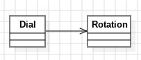

# Día 1a: Secret Entrance

## Descripción
Hay un dial circular de 100 posiciones (0-99) que empieza apuntando a 50. Se le aplica una secuencia de órdenes de rotación tipo L68, R48, etc. (L = izquierda/resta, R = derecha/suma, el número = cuántos clicks).

## Modelado conceptual en UML
<div style="text-align: center;">
  
</div>

## Patrón principal: Fluent Builder + Static Factory
[`Dial`](../src/main/java/software/aoc/day01/a/Dial.java) no se instancia con `new`, sino con un **factory method** (`Dial.create()`) que oculta el constructor (`private`). A partir de ahí se van encadenando llamadas:

```java
Dial.create().add("L1", "R1", "R50").position();
```

Esto se consigue porque `add(String...)` devuelve `this`, formando una **interfaz fluida (fluent interface)**. El resultado es una API que se lee casi como una frase, sin exponer el estado interno (`rotations`) ni requerir getters/setters.

## Record: `Rotation`
[`Rotation`](../src/main/java/software/aoc/day01/Rotation.java) es un `record` (una sola línea, sin lógica de estado mutable). Encapsula el "cómo se interpreta una orden" (`L68`, `R14`, ...) fuera de `Dial`, con su propio **static factory** (`Rotation.from(String)`). Esto separa responsabilidades:

- `Rotation` sabe **parsear e interpretar** una orden.
- `Dial` sabe **acumular y calcular** posiciones.
  Cada clase tiene una única razón para cambiar (SRP).

## Otras técnicas
- **Constantes con nombre** (`INITIAL_POSITION`, `DIAL_SIZE`) en vez de "números mágicos" sueltos en el código.
- **Métodos privados pequeños y con nombres reveladores de intención** (`sumAll`, `sumPartial`, `normalize`, `iterate`) — cada uno hace una sola cosa y se lee sin necesitar comentarios.
- **Streams en vez de bucles**: `sum`, `count`, `add(String...)` usan `Stream`/`IntStream` de forma declarativa (qué se quiere, no cómo iterarlo).
- **Paralelización explícita** en `iterate()` (`.parallel()`) aislada en un único punto, sin ensuciar el resto de la lógica.
- **Tell, don't ask**: `position()` y `count()` exponen el resultado ya calculado; nadie fuera de `Dial` pregunta por `rotations` para calcularlo por su cuenta.

## Test: DialTest
[`DialTest`](../src/test/java/software/aoc/day01/a/DialTest.java) usa nombres de método descriptivos (`given_orders_should_account_the_final_position`) que documentan el comportamiento esperado sin necesidad de comentarios adicionales, siguiendo el estilo *given/should*.
 