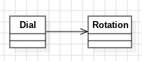

# Día 1a - Secret Entrance

## Descripción
Hay un dial circular de 100 posiciones (0-99) que empieza apuntando a `50`. Se le aplica una secuencia de órdenes de rotación tipo `L68`, `R48`, etc. (`L` = izquierda/resta, `R` = derecha/suma, el número = cuántos clicks). Hay que calcular la posición final del dial y cuántas de esas órdenes terminan exactamente en `0`.

## Modelo conceptual en UML
<div align="center">
  
</div>

## Patrones de diseño
### Static Factory Method — `Dial.create()`
[`Dial`](../src/main/java/software/aoc/day01/a/Dial.java) no se instancia con `new`: el constructor es `private` y la única puerta de entrada es `Dial.create()`. Frente a un constructor público, esto comunica intención ("construye un dial vacío en su posición inicial") y deja abierta la puerta a cambiar la construcción interna en el futuro sin afectar al código cliente.

### Fluent Interface — `add(...)`
`add(String... orders)` devuelve `this`, permitiendo encadenar llamadas:
```java
Dial.create().add("L1", "R1", "R50").position();
```
El resultado es una API que se lee casi como una frase, sin exponer el estado interno (`rotations`) ni requerir getters/setters.

### Immutable Value Object — `Rotation` como `record`
[`Rotation`](../src/main/java/software/aoc/day01/Rotation.java) es un `record` de una sola línea, con su propio *static factory* (`Rotation.from(String)`) que interpreta el signo (`L`/`R`) y la magnitud de una orden. Encapsula el "cómo se interpreta una orden" fuera de `Dial`, separando responsabilidades:
- `Rotation` sabe **parsear e interpretar** una orden.
- `Dial` sabe **acumular órdenes y calcular** posiciones.

## Clean Code
**Single Responsibility Principle (SRP)**
Cada clase tiene una única razón para cambiar: `Rotation` cambia si cambia el formato de una orden; `Dial` cambia si cambia cómo se acumulan o calculan posiciones.

**Constantes con nombre**
`INITIAL_POSITION` y `DIAL_SIZE` sustituyen a números mágicos sueltos en el código, dejando explícito qué representa cada valor.

**Métodos privados pequeños, un nivel de abstracción por método**
`sumAll`, `sumPartial`, `normalize`, `iterate` — cada uno hace una sola cosa y se lee sin necesitar comentarios. `position()` solo delega en `normalize(sumAll())`; `count()` solo delega en `iterate().map(this::sumPartial)...`.

**Uso idiomático de streams**
`add(String...)`, `sumAll()` y `count()` usan `Stream`/`IntStream` de forma declarativa (qué se quiere, no cómo iterarlo), evitando bucles con contadores mutables.

**Paralelización explícita y aislada**
`iterate()` marca el stream como `.parallel()` en un único punto del código, sin ensuciar el resto de la lógica con detalles de concurrencia.

**Tell, don't ask**
`position()` y `count()` exponen el resultado ya calculado; nada fuera de `Dial` pregunta por `rotations` para calcularlo por su cuenta.

## Tests
[`DialTest`](../src/test/java/software/aoc/day01/a/DialTest.java) usa nombres de método descriptivos (`given_orders_should_account_the_final_position`, `given_orders_should_account_the_times_that_position_is_zero`) que documentan el comportamiento esperado sin necesidad de comentarios adicionales, siguiendo el estilo *given/should*. Cubre tres niveles: casos puntuales con pocas órdenes, el ejemplo completo del enunciado, y el input real del puzzle (`password`), leído como recurso.