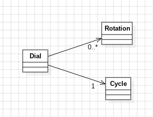

# Día 1b: Secret Entrance

## Descripción
El reto cambia respecto al apartado a: ya no basta con contar cuántas rotaciones **terminan** en `0`, hay que contar cuántas veces el dial **pasa** por `0`, incluso a mitad de una rotación.

## Modelado conceptual en UML
<div style="text-align: center;">
  
</div>

### Mismo patrón Fluent Builder + Static Factory, sin duplicar el modelo
[`Dial`](../src/main/java/software/aoc/day01/b/Dial.java) en  **reutiliza [`Rotation`](../src/main/java/software/aoc/day01/Rotation.java)** en vez de copiarlo. Como es un *value object* inmutable y sin dependencias de `Dial`, no hay motivo para duplicarlo: se importa directamente. Esto respeta **DRY** ya que el diseño original ya era lo bastante desacoplado como para reutilizarse en un contexto nuevo sin tocarlo.

### Un solo concepto: "posición cruda" en vez de dos
En vez de tratar "dónde termina cada rotación" (para `position()`) y "cuántas veces pasa por `0`" (para `count()`) como cosas separadas, se introduce un único concepto interno: `rawPosition(size)` — la suma acumulada **sin normalizar** tras las rotaciones. Es el mismo valor que ya calculaba `sumPartial` en la parte 1, solo que ahora se expone como pieza reutilizable en vez de mezclarse con la normalización. De ahí salen, con una sola responsabilidad cada uno:

- `position()` → normaliza la posición cruda final.
- `count()` → compara la posición cruda **antes** y **después** de cada rotación.

### Técnica: matemática en vez de simulación
La vía fácil era simular un `for` que vaya grado a grado, para contar los pasos por cero, pero es lento y oscurece el *qué* con el *cómo*. En su lugar, se calcula cuántos múltiplos de 100 hay entre dos posiciones crudas usando `Math.floorDiv`, sin iterar ni un solo grado, maximizando la eficiencia.

### Extraer `Cycle`: separar el dominio de la aritmética
[`Cycle`](../src/main/java/software/aoc/day01/b/Cycle.java) se encarga del dominio del puzzle y hacer aritmética modular (`normalize`, `crossings`, el tamaño del ciclo). Esa segunda parte no sabe nada de dials ni de rotaciones ya que trabaja sobre un ciclo de tamaño `N`.

```java
public record Cycle(int size) {
    public int normalize(int value) {
        return ((value < 0 ? size : 0) + value % size) % size;
    }
 
    public int crossings(int before, int after) {
        if (after == before) {
            return 0;
        }
        return after > before
                ? Math.floorDiv(after, size) - Math.floorDiv(before, size)
                : Math.floorDiv(before - 1, size) - Math.floorDiv(after - 1, size);
    }
}
```

`Dial` pasa a **delegar** en una instancia (`CYCLE = new Cycle(100)`) en vez de saber cómo funciona la aritmética circular:

```java
public int position() {
    return CYCLE.normalize(rawPosition(rotations.size()));
}
 
private int zeroCrossingsAt(int index) {
    return CYCLE.crossings(rawPosition(index - 1), rawPosition(index));
}
```

Beneficios de esta separación:
- **SRP real**: `Dial` se limita a acumular órdenes y preguntar al ciclo qué significa una posición cruda; ya no mezcla dominio con aritmética.
- **Testeable de forma aislada**: [`CycleTest`](../src/test/java/software/aoc/day01/b/CycleTest.java) prueba `crossings(50, -18)` con enteros sueltos, sin tener que construir un `Dial` con rotaciones para verificar el cálculo matemático.
- **Reutilizable y parametrizable**: si el ciclo tuviera otro tamaño, `Cycle` ya está listo — no hay una constante `DIAL_SIZE` incrustada en la lógica de `Dial`.