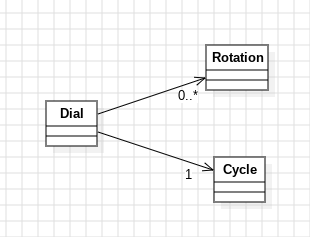

# Día 1b - Secret Entrance

## Descripción
El reto cambia respecto al apartado a: ya no basta con contar cuántas rotaciones **terminan** en `0`, hay que contar cuántas veces el dial **pasa** por `0`, incluso a mitad de una rotación.

## Modelo conceptual en UML
<div align="center">
  
</div>

## Qué cambia respecto a la parte A

**El modelo (`Rotation`) no cambia — se reutiliza tal cual**
[`Dial`](../src/main/java/software/aoc/day01/b/Dial.java) importa directamente [`Rotation`](../src/main/java/software/aoc/day01/Rotation.java) de la parte A en vez de copiarlo. Al ser un *value object* inmutable y sin dependencias de `Dial`, no hay motivo para duplicarlo: el diseño original ya era lo bastante desacoplado como para reutilizarse en un contexto nuevo sin tocarlo (DRY).

**Nuevo concepto: "posición cruda" en vez de calcular dos cosas por separado**
En la parte A, `position()` normalizaba el total acumulado y `count()` ni existía en esa forma. Aquí se introduce `rawPosition(size)`: la suma acumulada **sin normalizar** tras una secuencia de rotaciones. A partir de ese único cálculo salen, con una sola responsabilidad cada uno:
- `position()` → normaliza la posición cruda final.
- `count()` → compara la posición cruda **antes** y **después** de cada rotación para contar cuántas veces cruza el `0`.

**Matemática en vez de simulación**
La vía fácil sería simular un `for` que avance grado a grado para contar los pasos por cero, pero es lento y mezcla el *qué* con el *cómo*. En su lugar se calcula cuántos múltiplos de 100 hay entre dos posiciones crudas con `Math.floorDiv`, sin iterar ni un solo grado.

**Se extrae `Cycle`: separar el dominio de la aritmética**
[`Cycle`](../src/main/java/software/aoc/day01/b/Cycle.java) es un `record` nuevo que encapsula la aritmética modular (`normalize`, `crossings`) sobre un ciclo de tamaño `N` genérico, sin saber nada de dials ni de rotaciones:
```java
public record Cycle(int size) {
    public int normalize(int value) {
        return ((value < 0 ? size : 0) + value % size) % size;
    }

    public int crossings(int before, int after) {
        if (after == before) return 0;
        return after > before
                ? Math.floorDiv(after, size) - Math.floorDiv(before, size)
                : Math.floorDiv(before - 1, size) - Math.floorDiv(after - 1, size);
    }
}
```
`Dial` pasa a **delegar** en una instancia (`CYCLE = new Cycle(100)`) en vez de conocer los detalles de la aritmética circular:
```java
public int position() {
    return CYCLE.normalize(rawPosition(rotations.size()));
}

private int zeroCrossingsAt(int index) {
    return CYCLE.crossings(rawPosition(index - 1), rawPosition(index));
}
```

Beneficios de esta separación:
- **SRP real**: `Dial` se limita a acumular órdenes y preguntar al ciclo qué significa una posición cruda; ya no mezcla dominio con aritmética.
- **Testeable de forma aislada**: [`CycleTest`](../src/test/java/software/aoc/day01/b/CycleTest.java) prueba `crossings(50, -18)` con enteros sueltos, sin construir un `Dial` con rotaciones para verificar el cálculo matemático.
- **Reutilizable y parametrizable**: si el ciclo tuviera otro tamaño, `Cycle` ya está listo — no hay una constante `DIAL_SIZE` incrustada en la lógica de `Dial` como en la parte A.

El resto de la API pública de `Dial` (`create()`, `add(...)`, `execute(...)`) se mantiene idéntico a la parte A a propósito, para que solo cambie lo que realmente tenía que cambiar.