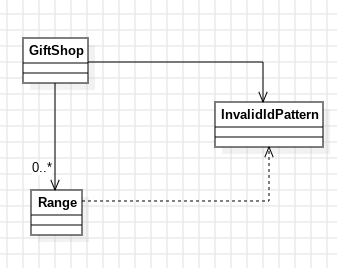

# Día 2a - Gift Shop

## Descripción
Solución al puzzle de los IDs de producto inválidos, centrada en mantener el diseño abierto a extensión sin duplicar lógica.

## Modelado conceptual en UML
<div align="center">
  
</div>

## Patrones de diseño
### Strategy — `InvalidIdPattern`
La forma de decidir si un ID es inválido cambia entre partes del ejercicio (parte A: dígitos repetidos dos veces; parte B: otro patrón). En vez de que [`Range`](../src/main/java/software/aoc/day02/Range.java) o [`GiftShop`](../src/main/java/software/aoc/day02/a/GiftShop.java) conozcan la regex directamente, esa regla se extrae a su propia clase:
```java
public class InvalidIdPattern {
    private final Pattern pattern;
    public boolean matches(long id) { ... }
}
```

`Range.invalidIds(InvalidIdPattern pattern)` recibe la estrategia como parámetro en vez de tenerla hardcodeada — el algoritmo de validación es intercambiable en tiempo de ejecución.

### Static Factory Method — `of(...)` y `create()`
```java
public static InvalidIdPattern of(String regex) { return new InvalidIdPattern(regex); }

// day02.a.GiftShop
private static final String DOUBLED_BLOCK = "^(\\d+)\\1$";
public static GiftShop create() { return new GiftShop(InvalidIdPattern.of(DOUBLED_BLOCK)); }
```
Frente a `new InvalidIdPattern(regex)`, `of(regex)` comunica intención ("construye esto *a partir de* un regex"). `GiftShop.create()` fija el patrón por defecto de la parte A, dejando el constructor con `InvalidIdPattern` explícito disponible para cuando se necesite otro (tests con patrones distintos, por ejemplo).

### Fluent Interface / Method Chaining — `GiftShop`
`add(...)` y `execute(...)` devuelven `this`, permitiendo encadenar llamadas:
```java
GiftShop.create().add("11-22").execute(input).sumOfInvalidIds();
```
Esto no es un Builder completo (no hay una construcción incremental con validación final), pero sigue el mismo espíritu: una API legible de izquierda a derecha que evita variables intermedias.

### Immutable Value Object — `Range` como `record`
```java
public record Range(long first, long last) { ... }
```
Un `record` en Java genera automáticamente constructor, `equals`, `hashCode` y accesores, y sus campos son `final`. Encaja perfectamente con `Range`, ya que sus datos son inmutables (representa el rango entre dos límites de un intervalo).

## Principios de Clean Code aplicados
**Single Responsibility Principle (SRP)**
Cada clase tiene una única razón para cambiar: `InvalidIdPattern` — cómo se valida un ID; `Range` — qué IDs hay entre dos límites; `GiftShop` — orquestación: parsear input, acumular rangos, sumar resultados.

**Dependency Injection por constructor**
`GiftShop` no crea su propio `InvalidIdPattern` internamente salvo en su factory method por defecto (`create()`); lo recibe:
```java
public GiftShop(InvalidIdPattern pattern) { ... }
```
Esto desacopla `GiftShop` de una regex concreta y hace el código testeable: en un test se puede inyectar un `InvalidIdPattern` distinto sin tocar `GiftShop`.

**Encapsulación real, no solo de campos** `InvalidIdPattern` no expone el `Pattern` de Java ni el string de la regex; expone únicamente `matches(long id)`. El resto del sistema no sabe (ni le importa) que por debajo hay una expresión regular.

**Nombres que revelan intención** `sumOfInvalidIds()`, `invalidIds(pattern)`, `InvalidIdPattern.matches(id)` — los nombres describen el qué sin necesidad de comentarios.

**Métodos pequeños, un nivel de abstracción por método** `execute(String input)` solo parsea y delega en `add`; `add(String... ranges)` solo convierte strings a `Range` y delega en `add(Range)`; `sumOfInvalidIds()` solo agrega.

**Uso idiomático de streams** `Arrays.stream(...).map(...).forEach(...)` y `ranges.stream().flatMapToLong(...).sum()` expresan transformaciones de datos declarativamente, evitando bucles con contadores mutables y condicionales anidados.

## Tests
[`GiftShopTest`](../src/test/java/software/aoc/day02/a/GiftShopTest.java) cubre tres niveles:
1. Casos puntuales de rangos individuales (`given_a_range_should_sum_invalid_ids`).
2. El ejemplo completo del enunciado (`sum_all_invalid_ids`).
3. El input real del ejercicio, leído como recurso (`reward`).

Todos usan `GiftShop.create()`, que fija el patrón de la parte A por defecto.