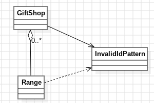

# Día 02 - Gift Shop

## Descripción
Solución al puzzle de los IDs de producto inválidos, en este caso los IDs de los de producto inválidos cambian, ya que, ahora hay que tener en cuenta si se repiten los números al menos dos veces, esto significa que si se repiten 2 o más veces hay que contabilizarlo.

## Modelado conceptual en UML
<div style="text-align: center;">
  
</div>

## Cambio con respecto a la parte A
Gracias al Strategy pattern, resolver la parte B del enunciado no debería requerir tocar [`GiftShop`](../src/main/java/software/aoc/day02/a/GiftShop.java) ni [`Range`](../src/main/java/software/aoc/day02/Range.java):

```java
new GiftShop(InvalidIdPattern.of("^(\\d+)\\1+$"))
        .execute(input)
        .sumOfInvalidIds();
```

Solo cambia la instancia de [`InvalidIdPattern`](../src/main/java/software/aoc/day02/InvalidIdPattern.java) que se inyecta; la orquestación y el modelo de datos se reutilizan sin modificaciones. Lo mismo aplica para el test [`GiftShopTest`](../src/test/java/software/aoc/day02/b/GiftShopTest.java) es casi igual con la diferencia que ahora tiene los resultados que se esperan del nuevo patrón.