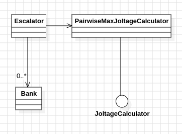

# Día 3a - Lobby
Solución al ejercicio "Lobby": dado un conjunto de bancos de baterías (cada uno una cadena de dígitos), encender exactamente **k** baterías por banco —preservando su orden— para maximizar el joltage que produce ese banco, y sumar el resultado de todos los bancos.

## Modelado conceptual en UML
<div align="center">
  
</div>

## Diseño y patrones aplicados
### Dependency Inversion + Strategy — `JoltageCalculator`
[`Bank`](../src/main/java/software/aoc/day03/Bank.java) y [`Escalator`](../src/main/java/software/aoc/day03/a/Escalator.java) no dependen de un algoritmo concreto, sino de una interfaz en el paquete raíz del día:
```java
package software.aoc.day03;
s
public interface JoltageCalculator {
    long compute(String digits);
}
```
[`PairwiseMaxJoltageCalculator`](../src/main/java/software/aoc/day03/a/PairwiseMaxJoltageCalculator.java) es una impslementación de esa interfaz, no la única posible: añadir otro algoritmo de joltage el día de mañana no exige tocar ni `Bank` ni `Escalator`, solo otra clase que implemente `JoltageCalculator` (Open/Closed).

### Factory Method — `Bank.from(...)`, `Escalator.create()` / `create(JoltageCalculator)`
Se evita exponer `new` directamente al código cliente:
```java
public static Bank from(String line) { ... }
public static Escalator create() { ... }
public static Escalator create(JoltageCalculator joltage) { ... }
```
`create()` fija la implementación por defecto de esta parte (`new PairwiseMaxJoltageCalculator()`) en un único sitio; `create(JoltageCalculator)` permite inyectar cualquier otra implementación de la interfaz sin tocar `Escalator` ni `Bank`.

### Fluent Interface — `Escalator`
`add(...)` y `execute(...)` devuelven `Escalator`, permitiendo encadenar llamadas sin variables intermedias:
```java
Escalator.create().add("987654321111111").totalOutputJoltage();
```

### Inyección de dependencias por constructor
`Escalator` recibe su `JoltageCalculator` desde fuera en lugar de crearlo internamente, desacoplando la orquestación del algoritmo concreto de cálculo y haciendo la clase testeable con cualquier implementación de la interfaz.

## Clean Code
- **Single Responsibility Principle**: cada clase cambia por un único motivo.
  - `PairwiseMaxJoltageCalculator`: cambia si cambia el *algoritmo* para elegir los mejores dígitos.
  - `Bank`: cambia si cambia cómo se *parsea* una línea de input.
  - `Escalator`: cambia si cambia cómo se *orquesta* el input o se *agrega* el resultado total.
- **Un único nivel de abstracción por método**: `PairwiseMaxJoltageCalculator.compute(...)` no mezcla "cómo se precalcula el mejor dígito a la derecha de cada posición" con "cómo se combina esa información para obtener el mejor valor de dos dígitos" — cada paso vive en su propio método privado (`maxDigitAfterEachPosition`, `bestTwoDigitValue`, `digitAt`).
- **Nombres que revelan intención**: `PairwiseMaxJoltageCalculator` dice qué algoritmo es, no solo qué contrato cumple; `maxDigitAfterEachPosition`, `bestTwoDigitValue`, `digitAt`, `totalOutputJoltage` se entienden solo con leer su firma.
- **Inmutabilidad en el dominio**: `Bank` es un `record` — no puede cambiar de estado tras construirse, y no expone forma alguna de mutar sus datos.
- **Composición sobre condicionales**: no hay ningún `if (parte == "A")` en `Escalator` ni en `Bank`. La diferencia de comportamiento entre partes vive únicamente en qué implementación de `JoltageCalculator` se inyecta.
- **Algoritmo lineal y descompuesto en pasos con nombre**: en vez de comparar por fuerza bruta todos los pares de posiciones (`O(n²)`), se precalcula en una sola pasada, de derecha a izquierda, el mayor dígito que queda a la derecha de cada posición (`maxDigitAfterEachPosition`). Con eso, encontrar la mejor combinación de dos dígitos es una segunda pasada lineal (`bestTwoDigitValue`) — el algoritmo completo es `O(n)`.
- **Construcción controlada**: el constructor de `Escalator` es `private`; la única forma de obtener una instancia desde fuera es `create()` o `create(JoltageCalculator)`.
- **Copia defensiva**: el constructor guarda `List.copyOf(banks)` en vez de la referencia recibida tal cual.

## Tests
[`EscalatorTest`](../src/test/java/software/aoc/day03/a/EscalatorTest.java) cubre:
1. Bancos individuales con la regla vigente (`given_a_bank_should_find_max_joltage`).
2. El ejemplo completo del enunciado (`sum_total_output_joltage`).
3. El input real del ejercicio, leído como recurso (`reward`).

Ningún test cubre `JoltageCalculator` (la interfaz) ni `PairwiseMaxJoltageCalculator` de forma aislada — como el resto del dominio compartido del repositorio, solo se ejercitan indirectamente a través de `Escalator`.