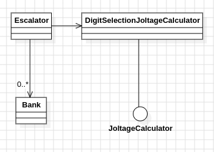

# Día 3b - Lobby
Segunda parte del ejercicio "Lobby": ahora hay que encender exactamente **doce** baterías por banco (en vez de dos), preservando su orden, para maximizar el joltage. La regla de "cuántas baterías se encienden" pasa a ser un parámetro, no un valor fijo en el código.

## Modelado conceptual en UML
<div align="center">
  
</div>

[`Bank`](../src/main/java/software/aoc/day03/Bank.java) vive en el paquete raíz `software.aoc.day03`, compartido con la parte A — no depende de qué algoritmo de joltage se use, solo de la interfaz [`JoltageCalculator`](../src/main/java/software/aoc/day03/JoltageCalculator.java). Todo el trabajo específico de esta parte se concentra en [`DigitSelectionJoltageCalculator`](../src/main/java/software/aoc/day03/b/DigitSelectionJoltageCalculator.java), la implementación de esa interfaz para esta parte.

## Qué cambia respecto a la parte A
En la parte A, la regla de "dos dígitos" estaba fija en el propio algoritmo de [`PairwiseMaxJoltageCalculator`](../src/main/java/software/aoc/day03/a/PairwiseMaxJoltageCalculator.java) (`bestTwoDigitValue`). Aquí, en cambio, `digitsToSelect` es un dato del objeto:
```java
public DigitSelectionJoltageCalculator(int digitsToSelect) {
    this.digitsToSelect = digitsToSelect;
}

public static DigitSelectionJoltageCalculator selecting(int digitsToSelect) {
    return new DigitSelectionJoltageCalculator(digitsToSelect);
}
```

Y el algoritmo ya no es el específico de "comparar pares" de la parte A — resuelve el problema general de "elegir los *k* dígitos que maximizan el número, preservando su orden". Se resuelve con una **pila monótona decreciente** recorrida en una sola pasada:
- Se recorren los dígitos de izquierda a derecha.
- Antes de añadir un dígito nuevo, mientras el último dígito guardado sea *peor* que el que llega (y todavía queden descartes disponibles), se elimina.
- Al final, se conservan los primeros `digitsToSelect` dígitos que sobrevivieron.

Este único algoritmo cubre tanto `k=2` (parte A) como `k=12` (parte B) sin ningún caso especial — es una generalización real, no una rama de código nueva por parte del ejercicio.

## Diseño y patrones aplicados
### Strategy — `JoltageCalculator`
`PairwiseMaxJoltageCalculator` (parte A) y `DigitSelectionJoltageCalculator` (esta parte) son dos implementaciones intercambiables de la misma interfaz, definida en el paquete raíz del día. `Bank` y `Escalator` solo conocen el contrato (`compute(digits): long`), nunca el algoritmo concreto:
```java
JoltageCalculator a = new PairwiseMaxJoltageCalculator();       // parte A
JoltageCalculator b = DigitSelectionJoltageCalculator.selecting(12); // parte B
```
El comportamiento distinto entre partes se resuelve con **qué implementación construyes**, no con condicionales ni clases duplicadas.

### Parametrización dentro de la propia implementación
Dentro de `DigitSelectionJoltageCalculator`, `digitsToSelect` viaja como dato inyectado en el constructor en vez de como constante fija — así la misma clase sirve tanto para `k=2` como para `k=12` sin tocar el algoritmo, solo la configuración con la que se construye la instancia.

### Factory Method — `DigitSelectionJoltageCalculator.selecting(...)`, `Escalator.create(...)`
`selecting(int digitsToSelect)` le da un nombre expresivo a la construcción ("crea un calculador que selecciona *k* dígitos") en vez de exponer `new DigitSelectionJoltageCalculator(12)` desnudo por todo el código cliente. [`Escalator`](../src/main/java/software/aoc/day03/b/Escalator.java) mantiene el mismo patrón que en la parte A: `create()` fija la configuración por defecto de esta parte (`selecting(12)`) en un único sitio, y `create(JoltageCalculator)` permite inyectar cualquier otra implementación de la interfaz.

### Inmutabilidad — `Escalator`
Cada `add(...)` / `execute(...)` devuelve una instancia **nueva** en vez de mutar la existente, el mismo enfoque de objeto persistente que tiene la parte A.

## Clean Code
- **Single Responsibility Principle**: `DigitSelectionJoltageCalculator` cambia si cambia el algoritmo de selección; `Bank` cambia si cambia cómo se parsea una línea; `Escalator` cambia si cambia cómo se orquesta el input o se agrega el resultado.
- **Un único nivel de abstracción por método**: `selectMaxDigits(...)` no mezcla "cómo se recorre la cadena" con "cuándo conviene descartar un dígito" — esa decisión vive aparte, en `canDiscardWorseDigit(...)`, con un nombre que explica exactamente qué comprueba.
- **Nombres que revelan intención**: `digitsToSelect`, `discardsRemaining`, `canDiscardWorseDigit`, `keepFirst` — cada nombre cuenta qué hace esa pieza sin necesidad de comentarios adicionales.
- **Guard clause legible en vez de condición anidada**: `canDiscardWorseDigit(...)` agrupa las tres condiciones necesarias (`selected` no vacío, quedan descartes, el último es peor que el actual) en un único método con nombre, en vez de un `while` con una expresión booleana larga.
- **Algoritmo lineal (`O(n)`)**: la pila monótona resuelve el problema en una sola pasada, frente a una fuerza bruta que probaría combinaciones de `k` posiciones (coste combinatorio, inviable para bancos largos con `k=12`).
- **Reutilización real, no copia-pega**: `Bank` no se duplica entre partes — es la misma clase, en el paquete raíz, para ambas.
- **Constante con nombre (DIGITS_TO_SELECT)** en vez de un "número mágico" suelto en el código. En este caso, _DIGITS_TO_SELECT_ se encarga de seleccionar 12 baterías.

## Tests
[`EscalatorTest`](../src/test/java/software/aoc/day03/b/EscalatorTest.java) cubre, además de los casos de la parte A (ahora con `DigitSelectionJoltageCalculator.selecting(2)` explícito en vez de un `create()` implícito):

1. Bancos individuales y el ejemplo completo con `k=2` (`given_a_bank_should_find_max_joltage`, `sum_total_output_joltage_with_two_batteries`).
2. Bancos individuales y el ejemplo completo con `k=12` (`given_a_bank_should_find_max_joltage_with_twelve_batteries`, `sum_total_output_joltage_with_twelve_batteries`).
3. El input real del ejercicio con la configuración por defecto de esta parte (`reward`, usando `Escalator.create()` → `selecting(12)`).

Como en la parte A, ningún test cubre `JoltageCalculator` ni `DigitSelectionJoltageCalculator` de forma aislada — solo se ejercitan indirectamente a través de `Escalator`.