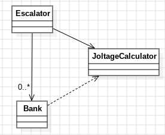

# Día 3b - Lobby
Segunda parte del ejercicio "Lobby": ahora hay que encender exactamente **doce** baterías por banco (en vez de dos), preservando su orden, para maximizar el joltage. La regla de "cuántas baterías se encienden" pasa a ser un parámetro, no un valor fijo en el código.

## Modelado conceptual en UML
<div style="text-align: center;">
  
</div>

[`Bank`](../src/main/java/software/aoc/day03/b/Bank.java) es idéntico al de la parte A — no ha hecho falta tocarlo. Todo el trabajo de esta parte se concentra en generalizar [`JoltageCalculator`](../src/main/java/software/aoc/day03/b/JoltageCalculator.java).

## Qué cambia respecto a la parte A
En la parte A, `JoltageCalculator` tenía la regla de "dos dígitos" fija en el propio algoritmo (`bestTwoDigitValue`). Aquí, en cambio, `digitsToSelect` es un
dato del objeto:
```java
public JoltageCalculator(int digitsToSelect) {
    this.digitsToSelect = digitsToSelect;
}

public static JoltageCalculator selecting(int digitsToSelect) {
    return new JoltageCalculator(digitsToSelect);
}
```

Y el algoritmo ya no es el específico de "comparar pares" de la parte A — necesita generalizarse a "elegir los k dígitos que maximizan el número, preservando su orden". Se resuelve con una **pila monótona decreciente** recorrida en una sola pasada:
- Se recorren los dígitos de izquierda a derecha.
- Antes de añadir un dígito nuevo, mientras el último dígito guardado sea *peor* que el que llega (y todavía queden descartes disponibles), se elimina.
- Al final, se conservan los primeros `digitsToSelect` dígitos que sobrevivieron.

Este único algoritmo cubre tanto `k=2` (parte A) como `k=12` (parte B) sin ningún caso especial — es una generalización real, no una rama de código nueva por parte del ejercicio.

## Diseño y patrones aplicados
### Parametrización en vez de duplicar clases o ramificar con condicionales
En vez de crear una `TwelveDigitJoltageCalculator` junto a la `TwoDigitJoltageCalculator` de la parte A (o meter un `if (part == B)` dentro del algoritmo), `digitsToSelect` viaja como dato inyectado. El comportamiento distinto entre partes se resuelve con **qué instancia construyes**, no con más código:
```java
JoltageCalculator.selecting(2);   // parte A
JoltageCalculator.selecting(12);  // parte B
```

Es la misma idea que el patrón **Strategy** persigue en el día 2 (aislar la regla de negocio del resto de clases), pero conseguida aquí con un simple campo de configuración en vez de una jerarquía de clases — más simple, porque el "algoritmo" en sí no cambia entre partes, solo uno de sus parámetros.

### Factory Method — `JoltageCalculator.selecting(...)`, `Escalator.create(...)`
`selecting(int digitsToSelect)` le da un nombre expresivo a la construcción ("crea un calculador que selecciona *k* dígitos") en vez de exponer `new JoltageCalculator(12)` desnudo por todo el código cliente. [`Escalator`](../src/main/java/software/aoc/day03/b/Escalator.java) mantiene el mismo patrón que en la parte A: `create()` fija la configuración por defecto de esta parte (`selecting(12)`) en un único sitio, y `create(JoltageCalculator)` permite inyectar cualquier otra.

### Inmutabilidad reforzada — `Escalator`
`Escalator` ya nace en esta parte con las dos protecciones que se añadieron a la parte A.
Cada `add(...)` / `execute(...)` sigue devolviendo una instancia **nueva** en vez de mutar la existente — el mismo enfoque de objeto persistente que ya tenía la parte A.

## Clean Code
- **Single Responsibility Principle**: `JoltageCalculator` cambia si cambia el algoritmo de selección; `Bank` cambia si cambia cómo se parsea una línea; `Escalator` cambia si cambia cómo se orquesta el input o se agrega el resultado.
- **Un único nivel de abstracción por método**: `selectMaxDigits(...)` no mezcla "cómo se recorre la cadena" con "cuándo conviene descartar un dígito" — esa decisión vive aparte, en `canDiscardWorseDigit(...)`, con un nombre que explica exactamente qué comprueba.
- **Nombres que revelan intención**: `digitsToSelect`, `discardsRemaining`, `canDiscardWorseDigit`, `keepFirst` — cada nombre cuenta qué hace esa pieza sin necesidad de comentarios adicionales.
- **Guard clause legible en vez de condición anidada**: `canDiscardWorseDigit(...)` agrupa las tres condiciones necesarias (`selected` no vacío, quedan descartes, el último es peor que el actual) en un único método con nombre, en vez de un `while` con una expresión booleana larga y difícil de leer de un vistazo.
- **Algoritmo lineal (`O(n)`)**: La pila monótona resuelve el problema en una sola pasada, frente a una fuerza bruta que probaría combinaciones de `k` posiciones (coste combinatorio, inviable para bancos largos con `k=12`).
- **Reutilización real, no copia-pega**: `Bank`, la estructura de `Escalator` y sus tests de la parte A no se han duplicado ni modificado — la parte B solo añade lo que realmente cambia (`JoltageCalculator` parametrizado).

## Tests
[`EscalatorTest`](../src/test/java/software/aoc/day03/b/EscalatorTest.java) cubre, además de los casos de la parte A (ahora con `selecting(2)` explícito en vez de un `create()` implícito). Estos siguen sirviendo para comprobar que la generalización a `k` dígitos no rompió el comportamiento de la parte A:

1. Bancos individuales y el ejemplo completo con `k=2` (`given_a_bank_should_find_max_joltage`, `sum_total_output_joltage_with_two_batteries`).
2. Bancos individuales y el ejemplo completo con `k=12` (`given_a_bank_should_find_max_joltage_with_twelve_batteries`, `sum_total_output_joltage_with_twelve_batteries`).
3. El input real del ejercicio con la configuración por defecto de esta parte (`reward`, usando `Escalator.create()` -> `selecting(12)`).