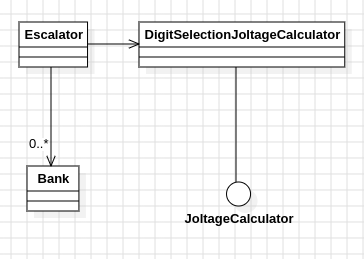

# Día 3b - Lobby

## Descripción
El reto cambia respecto al apartado a: ya no hay que encender **dos** baterías por banco, sino **doce**, preservando su orden, para maximizar el joltage. La regla de "cuántas baterías se encienden" pasa a ser un parámetro, no un valor fijo en el código.

## Modelo conceptual en UML
<div align="center">
  
</div>

## Qué cambia respecto a la parte A

**El algoritmo deja de ser específico de `k=2` y pasa a ser general**
En la parte A, [`PairwiseMaxJoltageCalculator`](../src/main/java/software/aoc/day03/a/PairwiseMaxJoltageCalculator.java) resolvía únicamente el caso de dos dígitos (`bestTwoDigitValue`), comparando cada posición con el mayor dígito a su derecha. Ese algoritmo no se puede extender a `k=12`: hace falta uno que resuelva el problema general de "elegir los *k* dígitos que maximizan el número, preservando su orden". [`DigitSelectionJoltageCalculator`](../src/main/java/software/aoc/day03/b/DigitSelectionJoltageCalculator.java) lo resuelve con una **pila monótona decreciente** en una sola pasada:
- Se recorren los dígitos de izquierda a derecha.
- Antes de añadir un dígito nuevo, mientras el último dígito guardado sea *peor* que el que llega (y todavía queden descartes disponibles), se elimina.
- Al final, se conservan los primeros `digitsToSelect` dígitos que sobrevivieron.

Este único algoritmo cubre tanto `k=2` como `k=12` sin ningún caso especial — es una generalización real, no una rama de código nueva. Sigue siendo `O(n)`, frente al coste combinatorio que tendría probar todas las combinaciones posibles de `k` posiciones (inviable para `k=12`).

**`digitsToSelect` pasa de estar fijo en el algoritmo a ser un dato inyectado**
```java
public DigitSelectionJoltageCalculator(int digitsToSelect) {
    this.digitsToSelect = digitsToSelect;
}

public static DigitSelectionJoltageCalculator selecting(int digitsToSelect) {
    return new DigitSelectionJoltageCalculator(digitsToSelect);
}
```
Así, la misma clase sirve tanto para `k=2` como para `k=12` sin tocar el algoritmo, solo la configuración con la que se construye la instancia. `selecting(int digitsToSelect)` le da nombre expresivo a esa construcción ("crea un calculador que selecciona *k* dígitos") en vez de exponer `new DigitSelectionJoltageCalculator(12)` desnudo en el código cliente.

**Constante con nombre en vez de número mágico**
`Escalator` fija su configuración por defecto con `DIGITS_TO_SELECT = 12` en un único sitio, en vez de tener un `12` suelto repetido por el código.

**Test**
[`EscalatorTest`](../src/test/java/software/aoc/day03/b/EscalatorTest.java) añade los casos con `k=12` (`given_a_bank_should_find_max_joltage_with_twelve_batteries`, `sum_total_output_joltage_with_twelve_batteries`) junto a los ya existentes con `k=2`, y ahora construye el `Escalator` con `create(DigitSelectionJoltageCalculator.selecting(...))` de forma explícita en los casos que fijan un `k` concreto, en vez de depender del `create()` implícito de la parte A.