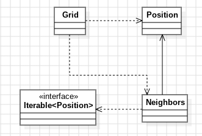

# Día 4a - Printing Department
Solución al ejercicio "Printing Department": dado un diagrama en forma de cuadrícula con rollos de papel (`@`), contar cuántos son accesibles para una carretilla — un rollo es accesible si tiene **menos de cuatro** rollos de papel entre sus ocho posiciones adyacentes.

## Modelo conceptual en UML
<div style="text-align: center;">
  
</div>

## Estructura
[`Position`](../src/main/java/software/aoc/day04/Position.java) representa una coordenada inmutable (fila, columna) y [`Neighbors`](../src/main/java/software/aoc/day04/Neighbors.java) representa el recorrido de las 8 posiciones adyacentes. Ambos viven en el paquete raíz porque son conceptos de dominio genéricos (una coordenada, un recorrido de vecindad) que no dependen de ninguna parte concreta del ejercicio. [`Grid`](../src/main/java/software/aoc/day04/a/Grid.java) vive en `day04.a` porque es la cuadrícula del diagrama donde se resuelven las reglas específicas de esta parte (qué cuenta como "accesible").

## Diseño y patrones aplicados

### Iterator — `Neighbors`
Antes de esta clase, calcular los vecinos de una posición implicaría anidar dos bucles (`for dr` / `for dc`) cada vez que hiciera falta, mezclando "cómo se calculan los desplazamientos" con "qué se hace con cada vecino". En su lugar, `Neighbors` encapsula ese recorrido:
```java
for (Position neighbor : Neighbors.of(position)) {
    if (isPaperRoll(neighbor)) count++;
}
```

`Grid.paperNeighborsCount(...)` no sabe que son 8 direcciones, ni cómo se calculan los desplazamientos — solo itera. Si el día de mañana cambiara la definición de "adyacente" (por ejemplo, a 4 direcciones en cruz en vez de 8), el único cambio necesario sería dentro de `Neighbors`; `Grid` seguiría intacto.

La implementación sigue el patrón GoF clásico: `Neighbors` implementa `Iterable<Position>`, y delega el recorrido en su propia clase interna `EightDirectionsIterator`, que implementa `Iterator<Position>` y mantiene el único estado mutable necesario (el índice de la posición actual) totalmente oculto del resto del sistema.

## Clean Code
- **Single Responsibility Principle**: `Position` solo sabe calcular una coordenada desplazada; `Neighbors` solo sabe enumerar posiciones vecinas; `Grid` solo sabe interpretar el diagrama y decidir accesibilidad. Ninguno necesita saber cómo funciona el otro por dentro.
- **Inmutabilidad**: `Position` es un `record` sin forma de mutar sus coordenadas. `Grid` también es un `record`, y su constructor compacto copia defensivamente la lista recibida (`rows = List.copyOf(rows)`), así que su estado no depende de que quien lo construyó no modifique después esa misma lista por fuera.
- **Guard clause con nombre en vez de condición compuesta inline**: `isAccessible(...)` se lee como una frase completa (`isPaperRoll(position) && paperNeighborsCount(position) < MAX...`), sin anidar condicionales ni repetir la comprobación de límites en cada sitio que la necesita.
- **Constantes con nombre**: `PAPER_ROLL` y `MAX_NEIGHBORS_FOR_ACCESS` en vez de literales `'@'` y `4` sueltos en medio de la lógica — el nombre explica por qué existe ese valor, no solo cuál es.
- **Un único punto de verdad para los límites de la cuadrícula**: `contains(...)` centraliza la comprobación de rango; tanto `isPaperRoll(...)` como el resto del código dependen de ese único método en vez de repetir la condición de bordes en varios sitios.
- **Nombres que revelan intención**: `accessiblePaperRollsCount`, `paperNeighborsCount`, `isPaperRoll`, `isAccessible` — cada método se entiende por su firma, sin necesidad de comentarios.
- **Construcción controlada**: los constructores de `Neighbors` y de su clase interna `EightDirectionsIterator` son `private`; la única forma de obtener un `Neighbors` desde fuera es `Neighbors.of(...)`, igual que `Grid.from(...)` es el único punto de entrada para construir una `Grid`.

## Tests
[`GridTest`](../src/test/java/software/aoc/day04/a/GridTest.java) cubre:
1. Casos puntuales de accesibilidad — un rollo con demasiados vecinos (`a_paper_roll_with_four_or_more_neighbors_is_not_accessible`) y uno con pocos (`a_paper_roll_with_fewer_than_four_neighbors_is_accessible`).
2. El ejemplo completo del enunciado (`count_all_accessible_paper_rolls`).
3. El input real del ejercicio, leído como recurso (`reward`).