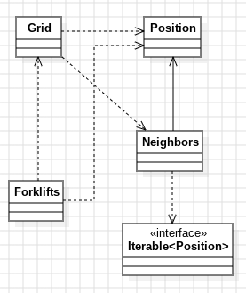

# Día 4b - Printing Department
Segunda parte del ejercicio "Printing Department": ya no basta con contar los rollos accesibles una vez — hay que **retirarlos** y repetir el proceso, porque al quitar unos, otros que antes tenían demasiados vecinos pueden quedar accesibles. Se repite hasta que ninguno más pueda retirarse, y se cuenta el total acumulado.

## Modelo conceptual en UML
<div style="text-align: center;">
  
</div>

## Qué cambia respecto a la parte A
[`Grid`](../src/main/java/software/aoc/day04/b/Grid.java) gana dos capacidades nuevas, ambas construidas sobre lo que ya existía (`isAccessible(...)`), sin tocar su lógica:
```java
public List<Position> accessiblePositions() { ... }     
public Grid withRollsRemoved(Collection<Position> positions) { ... }
```

`accessiblePaperRollsCount()` de la parte A ahora se apoya en `accessiblePositions().size()` en vez de repetir su propio recorrido — una única fuente de verdad para "qué posiciones son accesibles".

La novedad real de esta parte es una clase nueva, [`Forklifts`](../src/main/java/software/aoc/day04/b/Forklifts.java), que se encarga de **repetir** el proceso hasta que se estabiliza:
```java
while (!accessible.isEmpty()) {
    total += accessible.size();
    current = current.withRollsRemoved(accessible);
    accessible = current.accessiblePositions();
}
```

## Patrones y técnicas nuevas en esta parte
### Singleton — `Forklifts`
`Forklifts` no tiene estado propio (no guarda ningún rollo, ninguna cuadrícula entre llamadas) — es un servicio del dominio, no un dato. En vez de exponerlo como una colección de métodos estáticos sueltos, se modela como una única instancia accesible globalmente vía `getInstance()`, dejando claro que solo existe (y solo tiene sentido que exista) una carretilla-servicio en todo el sistema.

### SRP: separar "una pasada" de "repetir hasta estabilizar"
`Grid` sigue respondiendo únicamente "¿qué es accesible en este instante?" — no sabe nada de bucles ni de cuándo parar. `Forklifts` es quien decide *cuándo  detenerse* (cuando `accessible` queda vacío) y *cuánto acumular*. Son dos preguntas distintas — "estado de una cuadrícula" contra "proceso que actúa sobre cuadrículas sucesivas" — y por eso viven en clases distintas en vez de meter el `while` dentro de `Grid`.

### Inmutabilidad persistente, ahora con una secuencia de estados
`withRollsRemoved(...)` no muta la `Grid` sobre la que se llama — devuelve una `Grid` nueva. `Forklifts` encadena esas instancias (`current = current.withRollsRemoved(...)`) sin que ninguna cuadrícula anterior de la secuencia cambie jamás una vez creada; cada ronda es una fotografía distinta e inmutable del proceso.

### Reutilización real
[`Position`](../src/main/java/software/aoc/day04/Position.java) y [`Neighbors`](../src/main/java/software/aoc/day04/Neighbors.java) no se tocan ni se duplican para esta parte — `Forklifts` y el nuevo `Grid` los importan directamente del paquete compartido `software.aoc.day04`. El algoritmo de "ocho direcciones" (Iterator) sigue siendo exactamente el mismo que en la parte A, sin ninguna adaptación.

### Construcción controlada y sin duplicación
El constructor de `Forklifts` es `private`; `getInstance()` es el único punto de entrada posible, cerrando la garantía de "una única instancia" que promete el Singleton. Además, `Grid` ya no está duplicada entre `day04.a` y `day04.b`: se unificó en el paquete raíz compartido `software.aoc.day04`, igual que ya estaban `Position` y `Neighbors`. Cualquier cambio futuro en la lógica común (por ejemplo, en `isAccessible`) se hace en un único sitio, y ambas partes lo heredan automáticamente.

## Tests
Se añade [`ForkliftsTest`](../src/test/java/software/aoc/day04/b/ForkliftsTest.java) (en `day04.b`), con la misma estructura que los tests anteriores:

1. El ejemplo completo del enunciado, comprobando el total acumulado tras repetir el proceso hasta estabilizarse (`keeps_removing_accessible_rolls_until_none_are_left`, `43`).
2. El input real del ejercicio, leído como recurso (`removed`, `8739L`). 

[`GridTest`](../src/test/java/software/aoc/day04/b/GridTest.java) (en `day04.a`) no cambia de contenido respecto a la parte A — sigue verificando exactamente los mismos casos (accesibilidad puntual, el ejemplo completo y el input real), simplemente ahora importa `Grid` desde el paquete raíz compartido en vez de tener su propia copia.