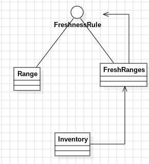

# Día 5a - Cafeteria
Solución al ejercicio "Cafeteria": dada una base de datos con rangos de IDs de ingredientes frescos y una lista de IDs disponibles, contar cuántos de esos IDs disponibles caen dentro de al menos uno de los rangos.

## Modelo conceptual en UML
<div style="text-align: center;">
  
</div>

## Estructura
[`FreshnessRule`](../src/main/java/software/aoc/day05/FreshnessRule.java) vive en el paquete raíz porque es un contrato genérico que no depende de ninguna parte concreta del ejercicio — cualquier cosa que sepa responder "¿es fresco este ID?" puede implementarlo.

## Diseño y patrones aplicados
### Composite — `Range` y `FreshRanges`
Podríamos decir que el enunciado plantea, una jerarquía de "todo/parte": un [`Range`](../src/main/java/software/aoc/day05/a/Range.java) individual y un grupo de `Range` (que pueden solaparse) necesitan responder exactamente a la misma pregunta — "¿este ID es fresco?" — y la respuesta del grupo es simplemente "sí, si lo es para *alguno* de sus miembros".
```java
public interface FreshnessRule {
    boolean isFresh(long id);
}

public record Range(long first, long last) implements FreshnessRule { ... }

public record FreshRanges(List<FreshnessRule> ranges) implements FreshnessRule {
    @Override
    public boolean isFresh(long id) {
        return ranges.stream().anyMatch(range -> range.isFresh(id));
    }
}
```

`Range` es la **hoja**: sabe responder por sí misma. [`FreshRanges`](../src/main/java/software/aoc/day05/a/FreshRanges.java) es el **compuesto**: delega la pregunta en sus hijos y combina las respuestas. Ninguno de los dos necesita saber con cuál de los dos está tratando [`Inventory`](../src/main/java/software/aoc/day05/a/Inventory.java) — ambos son, para quien los usa, simplemente un `FreshnessRule`. Esa es la idea central del patrón: tratar de forma uniforme un objeto individual y una composición de objetos.

Una ventaja práctica de haber tipado `FreshRanges` como `List<FreshnessRule>` (y no `List<Range>`) es que, si el ejercicio introdujera otro tipo de regla de frescura, `FreshRanges` podría agrupar rangos, esa nueva regla, o incluso otros `FreshRanges` anidados, sin cambiar ni una línea de su código.

### Factory Method — `Range.parse(...)`, `FreshRanges.from(...)`, `Inventory.from(...)`
Cada clase expone su propio punto de entrada con nombre, en vez de forzar `new` en el código cliente:
```java
Range.parse("3-5");
FreshRanges.from(rangesBlock);
Inventory.from(fullInput);
```

`Inventory.from(...)` es además el único sitio que sabe que el input tiene *dos* secciones separadas por una línea en blanco — ese detalle de formato no se filtra a `FreshRanges` ni a `Range`.

## Clean Code
- **Single Responsibility Principle**: `Range` solo sabe parsear y responder por sí mismo; `FreshRanges` solo sabe combinar reglas con "cualquiera de ellas"; `Inventory` solo sabe separar las dos secciones del input y delegar la pregunta de frescura. Ninguno mezcla responsabilidades del otro.
- **Sin condicionales de tipo**: En ningún sitio hay un `if (regla instanceof Range)` — el polimorfismo de `FreshnessRule` resuelve eso. Si mañana aparece un tercer tipo de regla, `Inventory` y `FreshRanges` no necesitan enterarse.
- **Inmutabilidad**: `Range`, `FreshRanges` e `Inventory` son todos `record`. `FreshRanges` e `Inventory` copian defensivamente sus listas en el constructor compacto (`List.copyOf(...)`), así que su estado no depende de que quien los construyó no modifique después esa misma lista por fuera.
- **Nombres que revelan intención**: `isFresh`, `FreshnessRule`, `freshIngredientsCount` — el vocabulario del código es el mismo que el del enunciado, sin traducir a términos técnicos genéricos.
- **Un único punto de verdad para el formato del input**: Solo `Inventory.from(...)` sabe que hay una línea en blanco separando secciones; `FreshRanges.from(...)` y `Range.parse(...)` reciben ya el bloque de texto que les corresponde, sin preocuparse de dónde empieza o termina.

## Tests
[`InventoryTest`](../src/test/java/software/aoc/day05/a/InventoryTest.java) cubre:
1. Casos puntuales de frescura — un ID fuera de todo rango (`an_id_outside_every_range_is_spoiled`), dentro de un único rango (`an_inside_a_single_range_is_fresh`) y dentro de rangos solapados (`an_id_inside_overlapping_ranges_is_still_fresh`).
2. El ejemplo completo del enunciado (`count_all_fresh_available_ingredients`).
3. El input real del ejercicio, leído como recurso (`answer`).