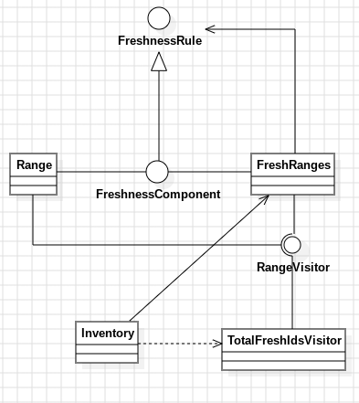

# Día 5b - Cafeteria
Segunda parte del ejercicio "Cafeteria": ya no importa qué IDs están disponibles — hay que contar cuántos IDs distintos cubren en total los rangos de frescura, fusionando los que se solapan para no contar el mismo ID dos veces.

## Modelo conceptual en UML
<div style="text-align: center;">
  
</div>

## Qué cambia respecto a la parte A
Calcular "cuántos IDs distintos cubren los rangos" exige fusionar solapamientos, y para eso hace falta acceder a los límites concretos (`first`/`last`) de cada [`Range`](../src/main/java/software/aoc/day05/b/Range.java) — algo que [`FreshnessRule`](../src/main/java/software/aoc/day05/FreshnessRule.java) no expone a propósito (solo pregunta `isFresh(id)`). En vez de forzar esa capacidad dentro de `Range`/ [`FreshRanges`](../src/main/java/software/aoc/day05/b/FreshRanges.java) o filtrar tipos con `instanceof`, se añade una vía nueva y opcional para recorrerlos:
```java
public interface FreshnessComponent extends FreshnessRule {
    void accept(RangeVisitor visitor);
}
```

`FreshnessRule` (la interfaz compartida de la parte A, en `software.aoc.day05`) no se toca ni se modifica — sigue teniendo un único método. [`FreshnessComponent`](../src/main/java/software/aoc/day05/b/FreshnessComponent.java) la extiende solo dentro de este paquete, así que la parte A no se entera de que esta capacidad existe.

## Patrones y técnicas nuevas en esta parte
### Visitor — `RangeVisitor` / `TotalFreshIdsVisitor`
`Range` y `FreshRanges` solo saben "aceptar" un visitor y reenviarle la visita — no saben qué hace ese visitor con la información:
```java
// Range (hoja)
public void accept(RangeVisitor visitor) {
    visitor.visit(this);
}

// FreshRanges (compuesto)
public void accept(RangeVisitor visitor) {
    ranges.forEach(range -> range.accept(visitor));
}
```

Toda la lógica de "cómo calcular el total" — ordenar, fusionar solapamientos, sumar longitudes — vive exclusivamente en [`TotalFreshIdsVisitor`](../src/main/java/software/aoc/day05/b/TotalFreshIdsVisitor.java), una clase que ni `Range` ni `FreshRanges` conocen. Es la operación **nueva** que se añade sobre la estructura sin modificarla: si mañana hiciera falta otra operación distinta (por ejemplo, "el rango más largo"), se escribiría otro [`RangeVisitor`](../src/main/java/software/aoc/day05/b/RangeVisitor.java) sin tocar `Range`, `FreshRanges` ni la parte A.

Esta separación también evita contaminar el Composite con responsabilidades que no le corresponden: `FreshRanges.accept(...)` simplemente reenvía la visita a sus hijos — no sabe que, al final, alguien va a fusionar rangos con lo que recoja.

### El Composite recupera su genericidad completa
`FreshRanges` sigue tratando `Range` individuales y grupos de forma uniforme (igual que en la parte A), pero ahora a través de `FreshnessComponent` en vez de `FreshnessRule` directamente. Con esto gana una segunda operación (`accept`) sin perder la primera (`isFresh`) ni obligar a elegir entre una lista de `Range` concretos o una lista de reglas genéricas — sigue siendo `List<FreshnessComponent>`, admitiendo en teoría rangos u otros grupos anidados.

## Clean Code
- **Abierto a extensión, cerrado a modificación**: añadir la capacidad de calcular el total no requirió tocar ni una línea de `Range.isFresh(...)` ni de `FreshRanges.isFresh(...)` — todo lo nuevo se añadió en clases y métodos aparte.
- **El algoritmo de fusión sigue descompuesto en pasos con nombre**: `sortedByFirst`, `mergeOverlapping`, `canMergeWithLast` — cada uno legible por separado, viviendo en `TotalFreshIdsVisitor` en vez de mezclado con la estructura de datos que atraviesan.
- **[`Inventory`](../src/main/java/software/aoc/day05/b/Inventory.java) no necesita saber cómo se calcula el total**: solo construye el visitor, se lo pasa a `freshRanges.accept(...)` y le pregunta el resultado — la orquestación no conoce el algoritmo, solo el protocolo (`accept` / `total`).

## Tests
Se añaden `count_total_fresh_ids_merging_overlapping_ranges` (con elejemplo del enunciado, `14`) y `answer` (con el input real) a [`InventoryTest`](../src/test/java/software/aoc/day05/b/InventoryTest.java), junto a los casos ya existentes de `freshIngredientsCount()` de la parte A, que no cambian de comportamiento.