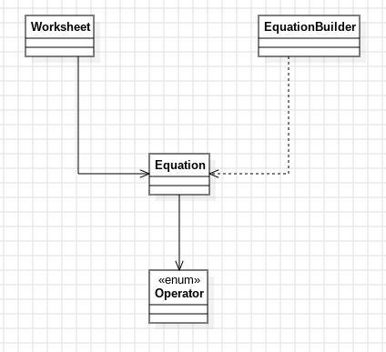

# Día 6a: Trash Compactor ---
El input es una hoja de matemáticas donde varios problemas están dispuestos en columnas, uno junto a otro. Cada columna tiene sus números apilados verticalmente y, debajo, el operador (`+` o `*`) que hay que aplicarles en orden. Las columnas se separan por espacios en blanco (la alineación exacta no importa).

## Modelo conceptual en UML

  

## Patrones de diseño
### Builder - [`EquationBuilder`](../src/main/java/software/aoc/day06/EquationBuilder.java) 
Acumula números por columna antes de crear la [`Equation`](../src/main/java/software/aoc/day06/Equation.java) inmutable.

### Strategy - `Operator`
Encapsula cada operación (+/*) intercambiable sin condicionales.

### Factory Method - `Operator.fromSymbol`, `Worksheet.from`
Crea objetos desde texto, encapsulando la lógica de parseo.

### Value Object - `Equation`, `Worksheet`
Datos inmutables con comportamiento propio.

## Clean Code
- **Nombres de dominio**: [`Worksheet`](../src/main/java/software/aoc/day06/a/Worksheet.java), `Equation`, `grandTotal` → código autodescriptivo.
- **Inmutabilidad**: records con `List.copyOf`, enum con campos `final`.
- **Funciones pequeñas, un nivel de abstracción**: `Worksheet.from` delega en `parseRows` + `buildEquations`.
- **DRY**: [`Operator`](../src/main/java/software/aoc/day06/Operator.java) usa `LongBinaryOperator` en vez de duplicar clases anónimas por cada operador.
- **Streams declarativos**: `solve()` y `grandTotal()` expresan intención, no bucles.
- **Constante con nombre**: `WHITESPACE` en vez de regex mágico.
- **Fail-fast**: `fromSymbol` lanza excepción con mensaje claro si el operador no existe.
- **SRP**: cada clase tiene una única responsabilidad.

## Tests
[`WorksheetTest`](../src/test/java/software/aoc/day06/a/WorksheetTest.java) verifica tres cosas: que cada ecuación individual del ejemplo se resuelve bien (`solves_each_individual_problem`), que la suma de todas da el `grandTotal` esperado (`sum_the_grand_total_of_every_problem`), y que el input real del puzzle (`/day06/input.txt`) produce la solución final (`answer`).