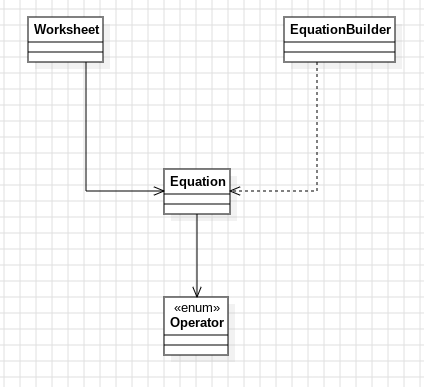

# Día 6a - Trash Compactor
El input es una hoja de matemáticas donde varios problemas están dispuestos en columnas, uno junto a otro. Cada columna tiene sus números apilados verticalmente y, debajo, el operador (`+` o `*`) que hay que aplicarles en orden. Las columnas se separan por espacios en blanco (la alineación exacta no importa).

## Modelo conceptual en UML
<div align="center">
  
</div>

## Patrones de diseño
### Builder - [`EquationBuilder`](../src/main/java/software/aoc/day06/EquationBuilder.java)
Acumula números por columna, uno a uno, antes de crear la [`Equation`](../src/main/java/software/aoc/day06/Equation.java) inmutable de una sola vez:
```java
public final class EquationBuilder {
    private final List<Long> numbers = new ArrayList<>();

    public EquationBuilder addNumber(long number) {
        numbers.add(number);
        return this;
    }

    public Equation build(Operator operator) {
        return new Equation(numbers, operator);
    }
}
```
Mientras se recorren las filas de la hoja, cada columna va acumulando sus propios números en su propio `EquationBuilder`; solo al final, cuando ya se conoce el operador de esa columna, se construye la `Equation` definitiva. Sin el Builder, habría que ir arrastrando listas sueltas de `long` por todo `Worksheet` hasta saber qué operador aplicarles.

### Strategy - `Operator`
Cada operación (`+`/`*`) es intercambiable sin condicionales, porque el comportamiento vive dentro del propio valor del enum:
```java
public enum Operator {
    ADD("+", Long::sum, 0L),
    MULTIPLY("*", (a, b) -> a * b, 1L);

    private final String symbol;
    private final LongBinaryOperator function;
    private final long identity;

    public long apply(long a, long b) {
        return function.applyAsLong(a, b);
    }

    public long identity() {
        return identity;
    }
}
```
`Equation.solve()` no sabe si está sumando o multiplicando — solo llama a `operator.apply(...)` con el `identity()` correspondiente como semilla:
```java
public long solve() {
    return numbers.stream().reduce(operator.identity(), operator::apply);
}
```

### Factory Method - `Operator.fromSymbol`, `Worksheet.from`
Crean objetos desde texto crudo, encapsulando la lógica de parseo en un único sitio con nombre:
```java
public static Operator fromSymbol(String symbol) {
    return Arrays.stream(values())
            .filter(operator -> operator.symbol.equals(symbol))
            .findFirst()
            .orElseThrow(() -> new IllegalArgumentException("Unkown operator: " + symbol));
}
```
```java
public static Worksheet from(String input) {
    List<String[]> rows = parseRows(input);
    List<String[]> numberRows = rows.subList(0, rows.size() - 1);
    String[] operatorSymbols = rows.getLast();
    return new Worksheet(buildEquations(numberRows, operatorSymbols));
}
```

### Value Object - `Equation`, `Worksheet`
Datos inmutables con comportamiento propio, no simples contenedores de campos:
```java
public record Equation(List<Long> numbers, Operator operator) {
    public Equation {
        numbers = List.copyOf(numbers);
    }

    public long solve() {
        return numbers.stream().reduce(operator.identity(), operator::apply);
    }
}
```

## Clean Code
- **Nombres de dominio, no técnicos**: la clase se llama `Worksheet` y el método `grandTotal()`, no `DataContainer` o `computeResult()`. El vocabulario del código es el mismo que el del enunciado del ejercicio, así que leer el código y leer el enunciado no requieren traducir mentalmente de un lenguaje a otro.

- **Inmutabilidad por defecto**: `Equation` y `Worksheet` son `record`, así que sus campos son `final` y no exponen setters. `Equation` además copia defensivamente su lista en el constructor compacto:
  ```java
  public Equation {
      numbers = List.copyOf(numbers);
  }
  ```
  Sin esta copia, alguien podría construir una `Equation`, quedarse con la referencia a la lista original por fuera, y modificarla después — cambiando silenciosamente el resultado de `solve()` sin pasar por ningún método de `Equation`. `List.copyOf` cierra esa puerta: una vez construida, la ecuación no puede cambiar por sorpresa.

- **Funciones pequeñas, un único nivel de abstracción por método**: `Worksheet.from(...)` no mezcla "cómo se separan líneas y columnas" con "cómo se construyen las ecuaciones" — delega cada pregunta en su propio método privado:
  ```java
  public static Worksheet from(String input) {
      List<String[]> rows = parseRows(input);
      List<String[]> numberRows = rows.subList(0, rows.size() - 1);
      String[] operatorSymbols = rows.getLast();
      return new Worksheet(buildEquations(numberRows, operatorSymbols));
  }
  ```
  Quien lee `from(...)` entiende el flujo completo en cuatro líneas sin necesitar saber todavía cómo se parsea una fila o cómo se ensambla una ecuación — esos detalles están un nivel más abajo, en `parseRows` y `buildEquations`, donde corresponde.

- **DRY vía composición de comportamiento, no herencia ni condicionales**: en vez de una clase `AddOperator` y otra `MultiplyOperator` (o un `switch` repetido cada vez que hace falta aplicar un operador), `Operator` guarda directamente la función como dato:
  ```java
  ADD("+", Long::sum, 0L),
  MULTIPLY("*", (a, b) -> a * b, 1L);
  ```
  Añadir un tercer operador el día de mañana (por ejemplo, resta) sería una línea nueva en el enum, no una clase nueva ni un `case` nuevo en ningún `switch` disperso por el código.

- **Streams declarativos en vez de bucles con acumuladores**: tanto `solve()` como `grandTotal()` dicen *qué* se quiere obtener, no *cómo* iterar para conseguirlo:
  ```java
  public long solve() {
      return numbers.stream().reduce(operator.identity(), operator::apply);
  }

  public long grandTotal() {
      return equations.stream().mapToLong(Equation::solve).sum();
  }
  ```
  Frente a un `for` con una variable `total` mutable que se va reasignando, `reduce`/`mapToLong`/`sum` dejan clarísimo, con una sola palabra cada uno, qué operación matemática se está haciendo.

- **Constante con nombre en vez de regex mágico**: `WHITESPACE = "\\s+"` documenta, con su nombre, qué separa las columnas — sin la constante, ese mismo regex aparecería suelto en medio de `parseRows`, obligando a quien lo lea a reconocerlo como "un patrón de espacios" en vez de simplemente leer su nombre.

- **Fail-fast con mensaje útil**: si el símbolo de un operador no coincide con ningún valor del enum, `fromSymbol` no devuelve `null` ni dispara un `NullPointerException` tres líneas más abajo cuando alguien intente usar ese resultado — falla inmediatamente, en el propio punto donde se detecta el problema, con un mensaje que dice exactamente qué símbolo no se reconoció:
  ```java
  .orElseThrow(() -> new IllegalArgumentException("Unkown operator: " + symbol));
  ```

- **Single Responsibility Principle**: `Equation` solo sabe resolverse a sí misma; `Operator` solo sabe qué operación matemática aplicar y con qué elemento neutro; `EquationBuilder` solo sabe acumular números hasta que se le pide construir; `Worksheet` solo sabe parsear el input y sumar el total de todas sus ecuaciones. Ninguna de las cuatro necesita conocer los detalles internos de las otras tres.

## Tests
[`WorksheetTest`](../src/test/java/software/aoc/day06/a/WorksheetTest.java) verifica tres cosas: que cada ecuación individual del ejemplo se resuelve bien (`solves_each_individual_problem`), que la suma de todas da el `grandTotal` esperado (`sum_the_grand_total_of_every_problem`), y que el input real del puzzle (`/day06/input.txt`) produce la solución final (`answer`).