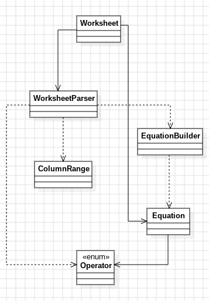

# Day 6b: Trash Compactor
Los cephalópodos leen las matemáticas al revés: cada **columna de carácter** es un número (dígito más significativo arriba), los problemas se separan por columnas en blanco y se leen de **derecha a izquierda**, tanto los números dentro de un bloque como los bloques entre sí.

## Modelo conceptual en UML

  

## Patrones de diseño
### Builder - `EquationBuilder`
Acumula dígitos leídos columna a columna antes de crear la [`Equation`](../src/main/java/software/aoc/day06/Equation.java) inmutable.

### Strategy - `Operator`
Comportamiento de +/* intercambiable, sin condicionales en `Equation`.

### Factory Method - `Worksheet.from`, `WorksheetParser.parse`, `Operator.fromSymbol` 
Encapsulan la creación de objetos a partir de texto crudo.

### Value Object - `Worksheet`, `Equation`, [`ColumnRange`](../src/main/java/software/aoc/day06/b/ColumnRange.java)
Datos inmutables con comportamiento propio

### Utility Class - `WorksheetParser` 
Agrupa funciones de parseo sin estado ni instanciación.

## Clean Code
- **Reutilización sin duplicar dominio**: `Equation`, [`Operator`](../src/main/java/software/aoc/day06/Operator.java) y [`EquationBuilder`](../src/main/java/software/aoc/day06/EquationBuilder.java) se movieron al paquete padre `day06` porque el "cómo resolver una ecuación" no cambia entre partes — solo cambia el parseo. `a` y `b` importan las mismas clases en vez de copiarlas.
- **Extracción de responsabilidad (SRP)**: el parseo complejo (detectar bloques, leer columnas de dígitos, leer operadores) se sacó de [`Worksheet`](../src/main/java/software/aoc/day06/b/Worksheet.java) a una clase nueva, [`WorksheetParser`](../src/main/java/software/aoc/day06/b/WorksheetParser.java), dejando `Worksheet` tan simple como en la parte A: solo `equations` + `grandTotal()`.
- **Value object con nombre**: `ColumnRange(start, end)` sustituye a pares sueltos de `int`, evitando *primitive obsession* y haciendo autoexplicativo `block.start()` / `block.end()`.
- **Funciones pequeñas, un nivel de abstracción**: `WorksheetParser.parse()` es un resumen de 4 líneas (`normalizeRows` → `findBlocks` → `buildEquations`); cada método privado resuelve un único paso (leer un número, leer un operador, detectar un bloque...).
- **Nombres que revelan intención**: `hasContentAt`, `readNumber`, `readOperator`, `normalizeRows` describen exactamente su propósito sin comentarios.
- **Fail-fast**: `readOperator` lanza `IllegalStateException` con contexto (`block`) si no encuentra operador, en vez de fallar silenciosamente o más tarde con un error críptico.
- **Clase utilitaria sin estado**: `WorksheetParser` es `final` con constructor privado y solo métodos estáticos — dice explícitamente "no soy un objeto, soy un conjunto de funciones de parseo".
- **Inmutabilidad**: `Worksheet` sigue copiando su lista en el constructor compacto del record.

## Tests
[`WorksheetTest`](../src/test/java/software/aoc/day06/b/WorksheetTest.java) (paquete `b`) comprueba: cada ecuación resuelta en el orden derecha→izquierda del ejemplo, el `grandTotal` del ejemplo, y el resultado con el input real del puzzle.