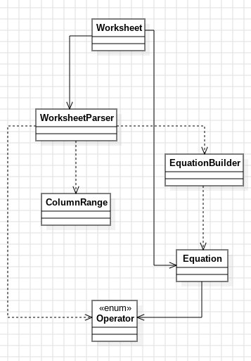

# Día 6b - Trash Compactor
Los cephalópodos leen las matemáticas al revés: cada **columna de carácter** es un número (dígito más significativo arriba), los problemas se separan por columnas en blanco y se leen de **derecha a izquierda**, tanto los números dentro de un bloque como los bloques entre sí.

## Modelo conceptual en UML
<div align="center">
  
</div>

## Qué cambia respecto a la parte A

**Por qué el problema ya no se puede resolver "por palabras"**
En la parte A, un número es una palabra rodeada de espacios (`123`, `45`), así que `line.split("\\s+")` basta para separarlos. Aquí el enunciado cambia la representación: cada número se escribe **verticalmente**, un dígito por fila, y todos los dígitos de un mismo número comparten **una única columna de carácter**. Con este ejemplo de test:
```
123 328  51 64 
 45 64  387 23 
  6 98  215 314
*   +   *   +  
```
la columna 0 (`1`, `4`, ` `) no forma parte del mismo número que la columna 1 (`2`, `5`, `6`) — cada columna *es* un número distinto, leído de arriba a abajo. `split("\\s+")` ya no sirve para nada: no hay palabras, hay columnas. Por eso hace falta un algoritmo distinto de raíz, no un ajuste del de la parte A.

**El parseo se extrae a una clase propia, en vez de crecer dentro de `Worksheet`**
Ese nuevo algoritmo tiene bastante más superficie que el de la parte A: hay que normalizar el ancho de las filas, detectar dónde empieza y termina cada bloque de columnas, leer un número recorriendo una columna verticalmente, y leer el operador de un bloque. Meter todo eso dentro de `Worksheet.from(...)` mezclaría dos preguntas muy distintas — "¿qué es un `Worksheet`?" y "¿cómo se interpreta este formato de texto concreto?" — en una sola clase. En su lugar, se extrae a [`WorksheetParser`](../src/main/java/software/aoc/day06/b/WorksheetParser.java), y [`Worksheet`](../src/main/java/software/aoc/day06/b/Worksheet.java) queda exactamente tan simple como en la parte A — solo `equations` + `grandTotal()` — delegando todo el parseo:
```java
public static Worksheet from(String input) {
    return new Worksheet(WorksheetParser.parse(input));
}
```
La ventaja no es solo estética: `WorksheetParser.parse(...)` se puede testear a fondo (formatos raros, filas de distinto ancho, bloques al borde del texto) sin tener que pasar por la API pública de `Worksheet`, y si el enunciado de un día futuro trajera un tercer formato de hoja, no haría falta tocar `Worksheet` en absoluto — solo escribir otro parser.

**Paso 1 — igualar el ancho de las filas**
El input real no viene perfectamente alineado (columnas más cortas al final de una fila), así que antes de buscar columnas hay que asegurarse de que todas las filas tengan la misma longitud:
```java
private static List<String> normalizeRows(String input) {
    List<String> rows = input.lines().filter(line -> !line.isBlank()).toList();
    int width = rows.stream().mapToInt(String::length).max().orElse(0);
    return rows.stream().map(row -> padTo(row, width)).toList();
}

private static String padTo(String row, int width) {
    return row.length() >= width ? row : row + " ".repeat(width - row.length());
}
```
Sin este paso, `charAt(column)` podría lanzar `StringIndexOutOfBoundsException` en filas más cortas que el ancho máximo — rellenar con espacios convierte "columna inexistente" en "columna en blanco", que es exactamente el mismo caso que ya hay que manejar para detectar separación entre bloques.

**Detectar los bloques por columnas en blanco**
`findBlocks(...)` recorre columna a columna buscando dónde empieza y termina cada bloque de contenido, en vez de asumir que un espacio simple separa cada número (como en la parte A):
```java
private static List<ColumnRange> findBlocks(List<String> numberRows) {
    int width = numberRows.getFirst().length();
    List<ColumnRange> blocks = new ArrayList<>();

    int blockStart = -1;
    for (int column = 0; column < width; column++) {
        boolean hasContent = hasContentAt(numberRows, column);
        if (hasContent && blockStart == -1) {
            blockStart = column;
        } else if (!hasContent && blockStart != -1) {
            blocks.add(new ColumnRange(blockStart, column - 1));
            blockStart = -1;
        }
    }
    if (blockStart != -1) {
        blocks.add(new ColumnRange(blockStart, width - 1));
    }
    return blocks;
}
```
`hasContentAt(...)` solo pregunta si *alguna* fila de números tiene un carácter no-blanco en esa columna — el algoritmo no necesita saber cuántas filas hay, ni qué dígitos son, solo dónde hay "algo" verticalmente. Aplicado al ejemplo de arriba, esto produce cuatro `ColumnRange`: uno por cada problema (`123`/`45`/`6`, `328`/`64`/`98`, `51`/`387`/`215`, `64`/`23`/`314`).

**Nuevo Value Object: `ColumnRange`**
```java
public record ColumnRange(int start, int end) {
}
```
Sustituye a pares sueltos de `int` (*primitive obsession*). Sin este record, `findBlocks` tendría que devolver `List<int[]>`, y cada sitio que lo consumiera necesitaría recordar (o comentar) que `arr[0]` es el inicio y `arr[1]` el final — un error de orden fácil de cometer y difícil de detectar en tiempo de compilación. Con `ColumnRange`, `block.start()` / `block.end()` son autoexplicativos y el compilador impide mezclar un `ColumnRange` con cualquier otro par de enteros por error.

**Leer un número recorriendo una columna de arriba a abajo**
Antes, en la parte A, un número ya venía como una palabra (`Long.parseLong("123")`). Aquí no existe esa palabra como tal — hay que reconstruirla dígito a dígito, leyendo la misma columna en cada fila:
```java
private static long readNumber(List<String> numberRows, int column) {
    StringBuilder digits = new StringBuilder();
    for (String row : numberRows) {
        char c = row.charAt(column);
        if (!Character.isWhitespace(c)) digits.append(c);
    }
    return Long.parseLong(digits.toString());
}
```
Como las filas más cortas ya se rellenaron con espacios en `normalizeRows`, el `if (!Character.isWhitespace(c))` filtra automáticamente las posiciones donde ese número concreto no tiene dígito en esa fila (números de distinto número de cifras dentro del mismo bloque), sin necesitar ningún caso especial.

**Se lee todo en orden inverso**
Tanto los bloques entre sí como los dígitos dentro de cada número se recorren en sentido contrario al habitual:
```java
private static List<Equation> buildEquations(List<ColumnRange> blocks, List<String> numberRows, String operatorRow) {
    List<Equation> equations = new ArrayList<>();
    for (int i = blocks.size() - 1; i >= 0; i--) {          // bloques: de derecha a izquierda
        equations.add(buildEquation(blocks.get(i), numberRows, operatorRow));
    }
    return equations;
}

private static Equation buildEquation(ColumnRange block, List<String> numberRows, String operatorRow) {
    EquationBuilder builder = new EquationBuilder();
    for (int column = block.end(); column >= block.start(); column--) {   // dentro del bloque: también de derecha a izquierda
        builder.addNumber(readNumber(numberRows, column));
    }
    return builder.build(Operator.fromSymbol(readOperator(operatorRow, block)));
}
```
Es la regla de negocio nueva del enunciado, no una casualidad de implementación: `EquationBuilder` sigue siendo el mismo de la parte A, solo cambia el orden en que se le van pasando los números.

**Lo que NO cambia:** [`Equation`](../src/main/java/software/aoc/day06/Equation.java), [`Operator`](../src/main/java/software/aoc/day06/Operator.java) y [`EquationBuilder`](../src/main/java/software/aoc/day06/EquationBuilder.java) — viven en el paquete raíz `software.aoc.day06` y se reutilizan tal cual desde la parte A. No se han movido para esta parte; ya estaban ahí desde el principio, porque "cómo se resuelve una ecuación ya construida" no depende de cómo se parseó el texto.

## Clean Code
- **Extracción de responsabilidad (SRP)**: el parseo complejo se sacó de `Worksheet` a `WorksheetParser`, en vez de inflar `Worksheet.from(...)` con toda esa lógica.
- **Funciones pequeñas, un nivel de abstracción**: `WorksheetParser.parse()` es un resumen de 4 líneas (`normalizeRows` → `findBlocks` → `buildEquations`); cada método privado resuelve un único paso (leer un número, leer un operador, detectar un bloque...).
- **Nombres que revelan intención**: `hasContentAt`, `readNumber`, `readOperator`, `normalizeRows` describen exactamente su propósito sin comentarios.
- **Fail-fast**: `readOperator` lanza `IllegalStateException` con contexto (`block`) si no encuentra operador:
  ```java
  private static String readOperator(String operatorRow, ColumnRange block) {
      for (int column = block.start(); column <= block.end(); column++) {
          char c = operatorRow.charAt(column);
          if (!Character.isWhitespace(c)) return String.valueOf(c);
      }
      throw new IllegalStateException("No operator found for block " + block);
  }
  ```
- **Clase utilitaria sin estado**: `WorksheetParser` es `final`, con constructor privado y solo métodos estáticos — no se puede instanciar por error ni extender.
- **Inmutabilidad**: `Worksheet` sigue copiando su lista en el constructor compacto del record, igual que en la parte A.

## Tests
[`WorksheetTest`](../src/test/java/software/aoc/day06/b/WorksheetTest.java) (paquete `b`) tiene la misma estructura que el de la parte A (`solves_each_individual_problem`, `sum_the_grand_total_of_every_problem`, `answer`), con resultados distintos por el nuevo orden de lectura derecha→izquierda.