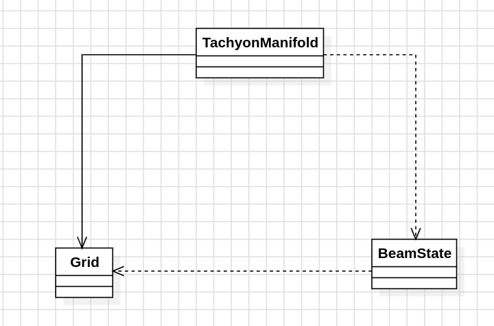

# Día 7a - Laboratories
Un haz de tachyones entra por `S` y avanza hacia abajo. Al chocar con un splitter (`^`) se detiene y nacen dos haces nuevos, uno a la izquierda y otro a la derecha de esa columna. Si dos haces confluyen en la misma columna, se fusionan en uno solo (no se cuentan doble). Hay que contar el **número total de splits** que ocurren hasta que todos los haces salen del diagrama o dejan de encontrar splitters.

## Modelo conceptual en UML

  

## Patrones de diseño
### Factory Method - `Grid.from`, `TachyonManifold.from`, `BeamState.startingAt` 
Encapsulan la construcción de objetos a partir de datos crudos (texto del diagrama, columna inicial).

### Immutable Value Object - `Grid`, `BeamState`, `TachyonManifold` 
Ninguno expone setters; cada transformación produce una instancia nueva en vez de mutar la existente.

### Fold / Reduce (patrón funcional) - `TachyonManifold.countSplits` 
Sustituye a un objeto de estado mutable recorrido con un bucle por una cadena de transformaciones puras, fila a fila.

## Clean Code
- **SRP**: tres clases, tres responsabilidades. [`Grid`](../src/main/java/software/aoc/day07/a/Grid.java) solo conoce el diagrama (parseo, límites, "¿hay splitter aquí?"). [`BeamState`](../src/main/java/software/aoc/day07/a/BeamState.java) solo conoce el estado del haz en una fila dada (qué columnas están activas, cuántos splits lleva). [`TachyonManifold`](../src/main/java/software/aoc/day07/a/TachyonManifold.java) solo orquesta: encadena estados fila a fila.
- **Inmutabilidad de principio a fin**: `Grid` y `BeamState` son records inmutables (`List.copyOf`, `Set.copyOf`). `advanceThrough` nunca muta el estado actual: siempre **devuelve un `BeamState` nuevo**. No hay campos `private` mutándose en un bucle.
- **Sin bucle imperativo de orquestación**: en vez de un `for` externo con un objeto acumulador mutable, `countSplits()` usa `IntStream.range(...).reduce(...)` para encadenar los estados fila a fila como una única expresión declarativa.
- **Nombres que revelan intención**: `advanceThrough`, `startingAt`, `isInBounds`, `addIfInBounds` — cada nombre dice exactamente qué hace sin necesitar comentarios.
- **Fail-fast**: `Grid.startColumn()` lanza `IllegalStateException` con mensaje claro si no encuentra la `S`, en vez de devolver `-1` y propagar un error confuso más adelante.
- **Deduplicación mediante el tipo de dato**: usar `Set<Integer>` para las columnas activas modela directamente la regla del enunciado ("dos haces que confluyen se fusionan"), sin necesidad de lógica extra para evitar contar splits duplicados.
- **Decisión consciente de NO forzar patrones**: los símbolos del diagrama (`.`, `^`, `S`) no tienen comportamiento propio distinto entre sí más allá de "es splitter o no", así que se comparan como `char` en `Grid.isSplitter` en lugar de crear un enum artificial solo para justificar un Strategy que no aportaría valor real aquí.

## Tests
[`TachyonManifoldTest`](../src/test/java/software/aoc/day07/a/TachyonManifoldTest.java) verifica que el ejemplo del enunciado produce `21` splits (`count_the_total_number_of_splits`), y un segundo test comprueba el resultado con el input real del puzzle (`answer`).