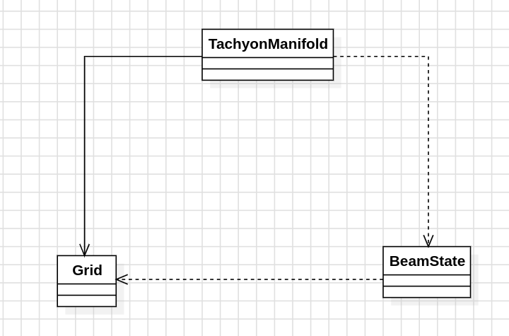

# Día 7a - Laboratories
Un haz de tachyones entra por `S` y avanza hacia abajo. Al chocar con un splitter (`^`) se detiene y nacen dos haces nuevos, uno a la izquierda y otro a la derecha de esa columna. Si dos haces confluyen en la misma columna, se fusionan en uno solo (no se cuentan doble). Hay que contar el **número total de splits** que ocurren hasta que todos los haces salen del diagrama o dejan de encontrar splitters.

## Modelado conceptual en UML
<div align="center">
  
</div>

## Patrones de diseño
### Factory Method — `Grid.from`, `TachyonManifold.from`, `BeamState.startingAt`
```java
public static Grid from(String input) {
    return new Grid(input.lines().filter(line -> !line.isBlank()).toList());
}

public static BeamState startingAt(int column) {
    return new BeamState(Set.of(column), 0);
}
```
Ninguno de los tres constructores recibe directamente lo que el resto del sistema necesita: `Grid` recibe texto crudo, no filas ya preparadas; `BeamState` recibe una columna suelta, no el `Set` con el que trabaja internamente. Si en el constructor público se aceptara un `List<String>` o un `Set<Integer>` ya construidos, quien llama tendría que saber construir esas estructuras exactamente como las espera la clase por dentro. Con `from(...)` y `startingAt(...)`, ese trabajo de traducción vive junto al dato que produce, no disperso por cada sitio que necesita un `Grid` o un `BeamState` nuevo.

### Immutable Value Object — `Grid`, `BeamState`, `TachyonManifold`
```java
public record BeamState(Set<Integer> columns, long splits) {
    public BeamState {
        columns = Set.copyOf(columns);
    }
    ...
}
```
Ninguno expone setters; cada transformación produce una instancia nueva en vez de mutar la existente. Esto importa especialmente aquí porque `TachyonManifold.countSplits()` va a encadenar muchos `BeamState` sucesivos (uno por fila del diagrama) — si `BeamState` fuera mutable, sería fácil que dos filas del recorrido terminaran compartiendo (y corrompiendo sin querer) el mismo `Set` por referencia. Al copiar (`Set.copyOf`) y devolver siempre un objeto nuevo, cada fila del recorrido tiene su propia fotografía del estado, sin posibilidad de que un paso posterior altere silenciosamente uno anterior.

### Fold / Reduce (patrón funcional) — `TachyonManifold.countSplits`
```java
public long countSplits() {
    BeamState initialState = BeamState.startingAt(grid.startColumn());

    BeamState finalState = IntStream.range(1, grid.rowCount())
            .boxed()
            .reduce(initialState, (state, row) -> state.advanceThrough(grid, row), (a, b) -> a);

    return finalState.splits();
}
```
La alternativa obvia sería un `for (int row = 1; row < grid.rowCount(); row++) { state = state.advanceThrough(grid, row); }` con una variable `state` reasignada en cada vuelta. Funcionalmente es lo mismo, pero `reduce` deja explícito, con una sola palabra, qué tipo de operación es esta: "parte de un valor inicial y ve combinándolo fila a fila hasta quedarte con uno final" — exactamente la definición de un fold. El `for` con reasignación no distingue a simple vista un fold de cualquier otro bucle con efectos secundarios; `reduce` sí.

## Clean Code
- **SRP**: tres clases, tres responsabilidades. [`Grid`](../src/main/java/software/aoc/day07/Grid.java) solo conoce el diagrama (parseo, límites, "¿hay splitter aquí?"). [`BeamState`](../src/main/java/software/aoc/day07/a/BeamState.java) solo conoce el estado del haz en una fila dada (qué columnas están activas, cuántos splits lleva). [`TachyonManifold`](../src/main/java/software/aoc/day07/a/TachyonManifold.java) solo orquesta: encadena estados fila a fila. Ninguna de las tres necesita abrir el código de las otras dos para saber qué hacen.

- **Fail-fast con mensaje útil**: 
  ```java
  public int startColumn() {
      int column = rows.getFirst().indexOf('S');
      if (column == -1) {
          throw new IllegalStateException("No start position ('S') found on the first row");
      }
      return column;
  }
  ```
  La alternativa fácil sería devolver `-1` y dejar que el error apareciera más tarde, en forma de `IndexOutOfBoundsException` al intentar leer la columna `-1` del diagrama — un error real, pero disparado lejos de su causa y sin ningún contexto de qué salió mal. Lanzar la excepción aquí mismo, con un mensaje que dice exactamente qué se buscaba y no se encontró, ahorra tener que rastrear hacia atrás desde un stack trace confuso.

- **Deduplicación mediante el tipo de dato, no mediante lógica extra**: usar `Set<Integer>` para las columnas activas modela directamente la regla del enunciado ("dos haces que confluyen se fusionan"). Si en su lugar se hubiera usado una `List<Integer>`, cada `advanceThrough` habría necesitado comprobar explícitamente `if (!nextColumns.contains(column))` antes de añadir, repitiendo esa comprobación en cada punto donde se añade una columna. Con `Set`, esa regla de negocio queda delegada por completo a la estructura de datos — es imposible que dos haces terminen "duplicados" en el mismo `BeamState`, porque el propio `Set` no lo permite.

- **Nombres que revelan intención**: `advanceThrough`, `startingAt`, `isInBounds`, `addIfInBounds` — cada nombre dice exactamente qué hace sin necesitar comentarios. Por ejemplo, `addIfInBounds(nextColumns, grid, row, column - 1)` se lee casi como una frase del enunciado ("añade esta columna si está dentro de los límites"), sin tener que entrar al método para saber qué comprobación hace.

- **Decisión consciente de NO forzar patrones**: los símbolos del diagrama (`.`, `^`, `S`) no tienen comportamiento propio distinto entre sí más allá de "es splitter o no", así que se comparan como `char` en `Grid.isSplitter` en lugar de crear un enum artificial solo para justificar un Strategy que no aportaría valor real aquí:
  ```java
  public boolean isSplitter(int row, int column) {
      return isInBounds(row, column) && rows.get(row).charAt(column) == '^';
  }
  ```
  Introducir un patrón donde no hace falta también tiene coste: una jerarquía de tipos para tres símbolos sin comportamiento propio añadiría indirección sin ganar nada a cambio — ni flexibilidad futura real, ni claridad. Aquí, comparar un `char` es simplemente la solución más simple que funciona.

## Tests
[`TachyonManifoldTest`](../src/test/java/software/aoc/day07/a/TachyonManifoldTest.java) verifica que el ejemplo del enunciado produce `21` splits (`count_the_total_number_of_splits`), y un segundo test comprueba el resultado con el input real del puzzle (`answer`).