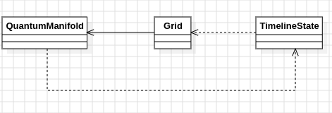

# Día 7b - Laboratories
Ahora el haz no se fusiona: en cada splitter, la partícula toma **ambos** caminos y la línea temporal se bifurca. Dos timelines que acaban en la misma columna siguen contando como distintas. Hay que contar el **número total de timelines** al final del recorrido, no el número de splits.

## Modelo conceptual en UML

  

## Diferencias con la Parte A
La diferencia de fondo entre las dos partes está en qué información hay que llevar de una fila a la siguiente. En la parte A solo importaba **si** había haz en una columna, así que bastaba con un `Set<Integer>` de columnas activas: cuando dos haces confluían, el propio `Set` los fusionaba de forma natural. En la parte B eso ya no vale, porque dos timelines que acaban en la misma columna siguen siendo dos timelines distintas — hay que **contarlas**, no solo detectar su presencia. Por eso `BeamState` se convierte en [`TimelineState`](../src/main/java/software/aoc/day07/b/TimelineState.java), que sustituye el `Set<Integer>` por un `Map<Integer, Long>` con el número de timelines que hay en cada columna.

Ese cambio de estructura arrastra un cambio de comportamiento al atravesar un splitter: en la parte A simplemente se añadía la columna izquierda y la derecha al conjunto (si ya estaban, no pasaba nada). En la parte B, el contador de la columna que se bifurca se **suma** tanto a la columna izquierda como a la derecha, así que cada split multiplica el número de timelines de esa rama en vez de limitarse a marcar presencia.

El resto de la forma se mantiene igual a propósito: [`QuantumManifold`](../src/main/java/software/aoc/day07/b/QuantumManifold.java) tiene la misma estructura que `TachyonManifold` (mismo Factory Method `from`, mismo `IntStream.reduce` para encadenar estados fila a fila), y ambas reutilizan la misma clase [`Grid`](../src/main/java/software/aoc/day07/Grid.java) sin tocarla.

## Patrones de diseño
- **Factory Method** en `QuantumManifold.from` y `TimelineState.startingAt`, encapsulando la construcción desde datos crudos (texto del diagrama, columna inicial), igual que en la parte A.
- **Immutable Value Object** en `Grid` (compartida), `TimelineState` y `QuantumManifold` — ninguno expone setters; cada transformación produce una instancia nueva.
- **Fold / Reduce** en `QuantumManifold.countTimelines`, la misma cadena de transformaciones puras fila a fila que en la parte A, solo que el estado que se transporta ahora es un mapa de conteos en vez de un conjunto de columnas.

## Clean Code
- **Reutilización sin duplicar dominio**: `Grid` vive en `day07` y ambas partes la importan tal cual, en vez de copiarla o crear una versión distinta para cada parte.
- **Mismo patrón estructural, distinta estructura de datos**: `TimelineState` conserva el rol de `BeamState` (inmutable, `advanceThrough(grid, row)` que devuelve un estado nuevo), pero cambia internamente de `Set` a `Map<Integer, Long>` porque el problema pasó de "detectar presencia" a "contar ocurrencias". El diseño no se reinventó, se adaptó al nuevo requisito.
- **Inmutabilidad**: `TimelineState` copia su mapa en el constructor compacto (`Map.copyOf`) y `advanceThrough` nunca muta el mapa recibido; siempre construye y devuelve uno nuevo.
- **`Map::merge` en vez de lógica condicional manual**: Tanto para acumular timelines en una columna existente como para sumarlas al bifurcarse en un splitter, se usa `next.merge(column, count, Long::sum)` en lugar de comprobar `containsKey` a mano — expresa directamente la regla "si ya había timelines aquí, súmalas" sin ramas explícitas.
- **Sin bucle imperativo de orquestación**: Igual que en la parte A, `countTimelines()` encadena los estados fila a fila con `reduce`, no con un `for` externo y un objeto mutable acumulador.
- **Nombres que revelan intención**: `timelinesByColumn` en vez de `columns` deja claro, solo con el nombre, que ya no es un conjunto de posiciones sino un recuento por posición.
- **Simetría deliberada con la Parte A**: Mantener la misma forma en `QuantumManifold` que en `TachyonManifold` hace evidente al lector que es "el mismo algoritmo con otra regla de fusión", sin necesidad de releer todo desde cero.

## Tests
[`QuantumManifoldTest`](../src/test/java/software/aoc/day07/b/QuantumManifoldTest.java) verifica que el ejemplo del enunciado produce `40` timelines (`counts_the_total_number_of_timelines`), y un segundo test comprueba el resultado con el input real del puzzle (`answer`).