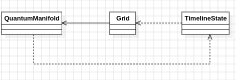

# Día 7b - Laboratories
Ahora el haz no se fusiona: en cada splitter, la partícula toma **ambos** caminos y la línea temporal se bifurca. Dos timelines que acaban en la misma columna siguen contando como distintas. Hay que contar el **número total de timelines** al final del recorrido, no el número de splits.

## Modelado conceptual en UML
<div align="center">
  
</div>

## Qué cambia respecto a la parte A

**Por qué un `Set` ya no alcanza**
En la parte A, `BeamState` guardaba un `Set<Integer>` de columnas activas porque la única pregunta relevante era "¿hay haz en esta columna, sí o no?" — y un `Set` responde exactamente a esa pregunta: no importa cuántas veces confluyan dos haces en la misma columna, la columna aparece una sola vez. Aquí esa misma propiedad del `Set` (que antes era justo lo que se necesitaba) se convierte en el problema: dos timelines que acaban en la misma columna **siguen siendo dos**, y un `Set` las colapsaría en una sola, perdiendo información que el enunciado pide contar. Por eso [`TimelineState`](../src/main/java/software/aoc/day07/b/TimelineState.java) sustituye el `Set<Integer>` por un `Map<Integer, Long>`: la clave sigue siendo la columna, pero el valor ahora es *cuántas* timelines hay ahí, no solo si hay alguna.
```java
public record TimelineState(Map<Integer, Long> timelinesByColumn) {
    public static TimelineState startingAt(int column) {
        return new TimelineState(Map.of(column, 1L));
    }
    ...
}
```

**El mismo cambio de estructura obliga a cambiar "combinar" por "sumar"**
```java
public TimelineState advanceThrough(Grid grid, Integer row) {
    Map<Integer, Long> next = new HashMap<>();
    timelinesByColumn.forEach((column, count) -> {
        if (grid.isSplitter(row, column)) {
            addIfInBounds(next, grid, row, column - 1, count);
            addIfInBounds(next, grid, row, column + 1, count);
        } else {
            next.merge(column, count, Long::sum);
        }
    });
    return new TimelineState(next);
}

private void addIfInBounds(Map<Integer, Long> target, Grid grid, int row, int column, long count) {
    if (grid.isInBounds(row, column)) target.merge(column, count, Long::sum);
}
```
En la parte A, atravesar un splitter era `nextColumns.add(column - 1); nextColumns.add(column + 1);` — "marcar presencia" en ambas ramas, sin importar si ya estaban marcadas. Aquí no basta con marcar: si la columna izquierda del split *ya* tenía timelines de otro camino que confluyó ahí, hay que **sumar** el `count` que llega a las que ya había, no simplemente anotar que "hay algo". `next.merge(column, count, Long::sum)` hace justo eso — y es la misma operación tanto para "seguir recto" (`else`) como para "bifurcarse" (dentro del `if`), lo que explica por qué ambas ramas llaman al mismo `merge` en vez de tener lógica distinta cada una.

**Por qué el resto no cambia — y por qué eso es intencional**
[`Grid`](../src/main/java/software/aoc/day07/Grid.java) se reutiliza tal cual desde la parte A, sin tocar una línea: nada en la forma de leer el diagrama (dónde está `S`, dónde hay un `^`) depende de si luego se cuenta con un `Set` o con un `Map`. [`QuantumManifold`](../src/main/java/software/aoc/day07/b/QuantumManifold.java) mantiene exactamente la misma forma que `TachyonManifold` (mismo Factory Method `from`, mismo `IntStream.reduce` para encadenar estados fila a fila):
```java
public long countTimelines() {
    TimelineState initialState = TimelineState.startingAt(grid.startColumn());
    TimelineState finalState = IntStream.range(1, grid.rowCount())
            .boxed()
            .reduce(initialState, (state, row) -> state.advanceThrough(grid, row), (a, b) -> a);
    return finalState.total();
}
```
Esto es deliberado, no casualidad: si `QuantumManifold` tuviera una forma distinta a `TachyonManifold` sin necesidad, quien lea las dos partes tendría que averiguar primero si la diferencia de forma significa algo (¿un algoritmo distinto? ¿un enfoque distinto?) antes de darse cuenta de que en realidad el único cambio real está en `TimelineState`. Mantener la misma forma comunica, solo con la estructura del código, "esto es el mismo algoritmo con otra regla de fusión" — sin tener que decirlo en un comentario.

## Clean Code
- **`Map::merge` en vez de lógica condicional manual**: la alternativa sin `merge` sería `if (next.containsKey(column)) { next.put(column, next.get(column) + count); } else { next.put(column, count); }` repetido en cada punto donde se añade una columna. `merge(column, count, Long::sum)` colapsa esas cuatro líneas en una, y además dice directamente la regla de negocio ("si ya había timelines aquí, súmalas") en vez de obligar a leer un `if`/`else` para inferirla.
- **Inmutabilidad**: `TimelineState` copia su mapa en el constructor compacto (`Map.copyOf`) y `advanceThrough` nunca muta el mapa recibido; siempre construye un `HashMap` nuevo (`next`) y lo devuelve envuelto en un `TimelineState` nuevo — igual que `BeamState` en la parte A, por la misma razón: evitar que dos pasos del `reduce` terminen compartiendo (y corrompiendo) el mismo mapa por referencia.
- **Nombres que revelan intención**: el campo se llama `timelinesByColumn`, no `columns` ni `map`. Solo con el nombre, sin mirar el tipo, ya queda claro que no es un conjunto de posiciones sino un recuento por posición — alguien que solo lea la firma del record entiende el cambio de modelo respecto a la parte A sin necesidad de comparar el código de las dos clases.

## Tests
[`QuantumManifoldTest`](../src/test/java/software/aoc/day07/b/QuantumManifoldTest.java) verifica que el ejemplo del enunciado produce `40` timelines (`counts_the_total_number_of_timelines`), y un segundo test comprueba el resultado con el input real del puzzle (`answer`).