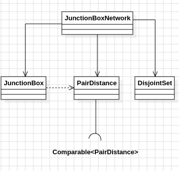

# Día 8a - Playground
Se dan las posiciones 3D de un conjunto de junction boxes. Hay que conectar las N parejas de cajas más cercanas entre sí (por distancia euclídea), formando circuitos: si dos cajas ya están en el mismo circuito, conectarlas de nuevo no hace nada. Tras hacer las N conexiones más cortas, se pide el producto de los tamaños de los tres circuitos más grandes.

En el ejemplo, tras las 10 conexiones más cortas quedan circuitos de tamaño 5, 4, 2, 2 y siete de tamaño 1 → el producto de los tres mayores (`5 * 4 * 2`) da `40`.

## Modelo conceptual en UML

  

## Patrones de diseño
### El patrón central: Union-Find (Disjoint Set)
A diferencia de los días anteriores, aquí no encaja ni Builder, ni Strategy, ni un reduce fila a fila: la pregunta que hace el enunciado es literalmente "¿estas dos cajas ya están en el mismo grupo? si no, únelas" — que es la definición textual de la estructura **Union-Find** (también llamada Disjoint Set Union). No es una metáfora forzada para encajar un patrón conocido, sino la estructura de datos estándar para este tipo de problema de conectividad.

[`DisjointSet`](../src/main/java/software/aoc/day08/a/DisjointSet.java) implementa las dos operaciones clásicas:
- `find(element)`: sigue la cadena de `parent` hasta encontrar la raíz del grupo al que pertenece un elemento.
- `union(a, b)`: si `a` y `b` ya comparten raíz, no hace nada; si no, cuelga el árbol más pequeño bajo el más grande (**union by size**), la optimización estándar del patrón para evitar cadenas largas sin necesitar compresión de caminos mutable.

### Inmutabilidad
`DisjointSet` es un record inmutable (`Map.copyOf` en el constructor compacto) y `union` **no muta nada**: copia los mapas actuales (`new HashMap<>(parent)`, `new HashMap<>(sizes)`), aplica el cambio sobre la copia y devuelve una instancia nueva. El estado anterior sigue siendo válido y consultable después de llamar a `union` — es una estructura de datos persistente, no una mutable con setters. Este mismo criterio se aplica a [`JunctionBox`](../src/main/java/software/aoc/day08/a/JunctionBox.java), [`PairDistance`](../src/main/java/software/aoc/day08/a/PairDistance.java) y [`JunctionBoxNetwork`](../src/main/java/software/aoc/day08/a/JunctionBoxNetwork.java): todos son records inmutables sin exponer colecciones mutables hacia fuera.

## Clean Code
- **SRP**: `JunctionBox` solo calcula distancias; `DisjointSet` solo agrupa y consulta circuitos; `JunctionBoxNetwork` solo orquesta el flujo completo (parsear → ordenar pares → conectar → calcular el producto).
- **Nombres que revelan intención**: `closestPairsFirst`, `connectClosest`, `circuitSizes`, `productOfLargestCircuits` — se leen casi como el propio enunciado, sin necesitar comentarios.
- **Parámetros explícitos en vez de "magic numbers"**: `productOfLargestCircuits(int connections, int topN)` deja explícitos cuántas conexiones hacer y cuántos circuitos multiplicar, en vez de tener `10`/`3`/`1000` incrustados en el cuerpo del método.
- **`Comparable` en el propio value object**: `PairDistance` implementa `Comparable<PairDistance>` comparando por `distanceSquared`, así que ordenar la lista de pares es una simple llamada a `.sorted()`, sin comparadores externos ni lambdas repetidas en cada sitio donde haga falta ordenar.

## Test
[`JunctionBoxNetworkTest`](../src/test/java/software/aoc/day08/a/JunctionBoxNetworkTest.java) comprueba, con el ejemplo del enunciado, que tras hacer las 10 conexiones más cortas (`connections = 10`) el producto de los tamaños de los tres circuitos más grandes (`topN = 3`) da `40`, tal como describe el enunciado paso a paso.