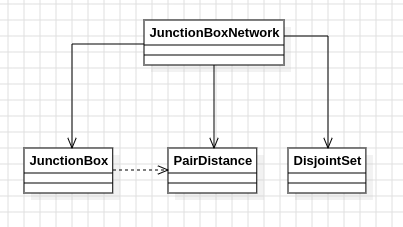

# Día 8a - Playground
Se dan las posiciones 3D de un conjunto de junction boxes. Hay que conectar las N parejas de cajas más cercanas entre sí (por distancia euclídea), formando circuitos: si dos cajas ya están en el mismo circuito, conectarlas de nuevo no hace nada. Tras hacer las N conexiones más cortas, se pide el producto de los tamaños de los tres circuitos más grandes.

En el ejemplo, tras las 10 conexiones más cortas quedan circuitos de tamaño 5, 4, 2, 2 y siete de tamaño 1 → el producto de los tres mayores (`5 * 4 * 2`) da `40`.

## Modelado conceptual en UML
<div align="center">
  
</div>

## Patrones de diseño
### El patrón central: Union-Find (Disjoint Set)
A diferencia de los días anteriores, aquí no encaja ni Builder, ni Strategy, ni un reduce fila a fila: la pregunta que hace el enunciado es literalmente "¿estas dos cajas ya están en el mismo grupo? si no, únelas" — que es la definición textual de la estructura **Union-Find** (también llamada Disjoint Set Union). No es una metáfora forzada para encajar un patrón conocido, sino la estructura de datos estándar para este tipo de problema de conectividad.

[`DisjointSet`](../src/main/java/software/aoc/day08/DisjointSet.java) implementa las dos operaciones clásicas:
```java
public int find(int element) {
    int current = element;
    while (parent.get(current) != current) current = parent.get(current);
    return current;
}

public DisjointSet union(int a, int b) {
    int rootA = find(a);
    int rootB = find(b);
    if (rootA == rootB) return this;

    int smaller = sizes.get(rootA) <= sizes.get(rootB) ? rootA : rootB;
    int larger = smaller == rootA ? rootB : rootA;

    Map<Integer, Integer> newParent = new HashMap<>(parent);
    Map<Integer, Integer> newSizes = new HashMap<>(sizes);
    newParent.put(smaller, larger);
    newSizes.put(larger, sizes.get(smaller) + sizes.get(larger));
    newSizes.remove(smaller);

    return new DisjointSet(newParent, newSizes);
}
```
`find(element)` sigue la cadena de `parent` hasta encontrar la raíz del grupo al que pertenece un elemento — sin esta indirección, saber si dos cajas están conectadas exigiría recorrer todo el grafo de conexiones cada vez. `union(a, b)` cuelga el árbol más pequeño bajo el más grande (**union by size**, comparando `sizes.get(rootA)` contra `sizes.get(rootB)`): si en vez de eso siempre se colgara `a` bajo `b` sin mirar tamaños, cadenas largas de uniones desequilibradas podrían convertir `find` en una operación lineal en el peor caso, en vez de prácticamente constante. Es la optimización estándar del patrón para evitar cadenas largas sin necesitar compresión de caminos mutable (que sí requeriría que `find` modificara el propio `DisjointSet` según se usa, rompiendo la inmutabilidad del resto del diseño).

## Clean Code
- **Inmutabilidad como estructura persistente, no solo como buena práctica**: `DisjointSet` es un record inmutable (`Map.copyOf` en el constructor compacto) y `union` **no muta nada** — copia los mapas actuales (`new HashMap<>(parent)`, `new HashMap<>(sizes)`), aplica el cambio sobre la copia y devuelve una instancia nueva. Esto importa aquí en concreto porque `connectClosest` va a llamar a `union` una vez por cada conexión, encadenando estados sucesivos:
  ```java
  private DisjointSet connectClosest(List<PairDistance> sortedPairs, int connections) {
      DisjointSet state = DisjointSet.singleTons(boxes.size());
      int limit = Math.min(connections, sortedPairs.size());
      for (int i = 0; i < limit; i++) {
          PairDistance pair = sortedPairs.get(i);
          state = state.union(pair.first(), pair.second());
      }
      return state;
  }
  ```
  Si `union` mutara el `DisjointSet` original en vez de devolver uno nuevo, cualquier referencia previa al estado "antes de esta unión" quedaría invalidada sin aviso — algo que en la parte B (donde hace falta comparar el estado *antes* y *después* de cada unión) sería directamente incorrecto. Este mismo criterio se aplica a [`JunctionBox`](../src/main/java/software/aoc/day08/JunctionBox.java), [`PairDistance`](../src/main/java/software/aoc/day08/PairDistance.java) y [`JunctionBoxNetwork`](../src/main/java/software/aoc/day08/a/JunctionBoxNetwork.java): todos son records inmutables sin exponer colecciones mutables hacia fuera.

- **SRP**: `JunctionBox` solo calcula distancias; `DisjointSet` solo agrupa y consulta circuitos; `JunctionBoxNetwork` solo orquesta el flujo completo (parsear → ordenar pares → conectar → calcular el producto). Ninguna de las tres mezcla el "qué" con el "cómo" de las otras dos.

- **Nombres que revelan intención**: `closestPairsFirst`, `connectClosest`, `circuitSizes`, `productOfLargestCircuits` — se leen casi como el propio enunciado, sin necesitar comentarios. Un lector puede seguir `productOfLargestCircuits(...)` → `closestPairsFirst()` → `connectClosest(...)` y reconstruir el algoritmo completo solo con los nombres de los métodos.

- **Parámetros explícitos en vez de "magic numbers"**:
  ```java
  public long productOfLargestCircuits(int connections, int topN) {
  ```
  deja explícitos cuántas conexiones hacer y cuántos circuitos multiplicar, en vez de tener `10`/`3` incrustados directamente en el cuerpo del método. Esto es lo que permite que el mismo método sirva tanto para el ejemplo del enunciado (`productOfLargestCircuits(10, 3)`) como para el input real (`productOfLargestCircuits(1000, 3)`) sin duplicar código ni tocar `JunctionBoxNetwork`.

- **`Comparable` en el propio value object**:
  ```java
  public record PairDistance(int first, int second, long distance) implements Comparable<PairDistance> {
      @Override
      public int compareTo(PairDistance other) {
          return Long.compare(distance, other.distance);
      }
  }
  ```
  Con esto, ordenar la lista de pares es una simple llamada a `.sorted()` sin argumentos, en vez de tener que pasar un `Comparator.comparingLong(PairDistance::distance)` (o repetir esa misma lambda) en cada sitio donde haga falta ordenar pares — la regla de "cómo se ordenan los `PairDistance`" vive una sola vez, junto al propio tipo.

## Tests
[`JunctionBoxNetworkTest`](../src/test/java/software/aoc/day08/a/JunctionBoxNetworkTest.java) comprueba, con el ejemplo del enunciado, que tras hacer las 10 conexiones más cortas (`connections = 10`) el producto de los tamaños de los tres circuitos más grandes (`topN = 3`) da `40`, tal como describe el enunciado paso a paso, y un segundo test comprueba el resultado con el input real del puzzle (`answer`).