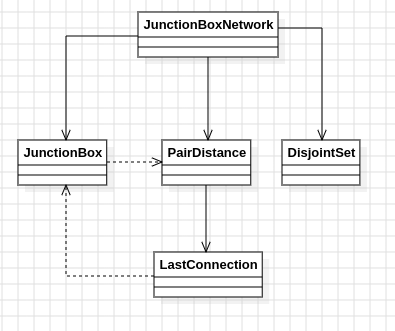

# Día 8b - Playground
Ya no basta con un número fijo de conexiones: hay que seguir conectando las parejas de cajas más cercanas, en orden creciente de distancia, hasta que **todas** las cajas terminen en un único circuito. Se pide el producto de las coordenadas X de las dos cajas que forman esa última conexión, la que termina de unificar toda la red.

## Modelo conceptual en UML

  

## Patrones de diseño
### El patrón: Union-Find como criterio de parada de Kruskal
La Parte A se detenía tras un número fijo de conexiones y medía tamaños de circuitos. Aquí el criterio de parada es distinto: se sigue procesando pares en orden creciente de distancia hasta que el número de circuitos activos llega a `1`. Esto es exactamente el criterio de parada del **algoritmo de Kruskal** para construir un árbol de expansión mínimo: procesar aristas ordenadas por peso y detenerse tras exactamente `n - 1` uniones exitosas. No hace falta construir el árbol completo ni guardar la lista de aristas usadas — solo se necesita la última unión que provoca la unificación total, así que basta con contar cuántos circuitos quedan.

### Aprovechar la semántica ya existente en vez de añadir estado nuevo
`DisjointSet.union(a, b)` ya devolvía `this` (la misma instancia) cuando `a` y `b` estaban en el mismo circuito, como optimización natural de la estructura persistente. Esa propiedad se reutiliza aquí como señal: comparando el resultado de `union` con el estado anterior por identidad (`next != state`) se sabe si la conexión fue realmente nueva, sin necesitar un `Set` de raíces vistas ni volver a llamar a `find` para comparar antes y después. Es una forma de resolver el problema apoyándose en el comportamiento que la estructura ya ofrecía, en vez de sumar lógica redundante encima.

### Value object con nombre para el resultado
En vez de devolver un array de dos posiciones o un `Map.Entry` sin significado explícito, el resultado se modela como `LastConnection(JunctionBox first, JunctionBox second)`, con su propio método `xProduct()`. El nombre del tipo comunica directamente qué representa ("la conexión que completó la red"), y el cálculo del producto queda encapsulado junto a los datos que lo originan, en vez de esparcirse como una operación suelta en quien consume el resultado.

## Clean Code
- **Reutilización total del dominio compartido**: `JunctionBox`, `PairDistance` y `DisjointSet` no cambian ni una línea respecto a la Parte A; toda la lógica nueva vive en [`JunctionBoxNetwork`](../src/main/java/software/aoc/day08/b/JunctionBoxNetwork.java) (Parte B) y en el nuevo [`LastConnection`](../src/main/java/software/aoc/day08/b/LastConnection.java).
- **Fail-fast**: si la red nunca llegase a conectarse del todo (por ejemplo, datos corruptos), se lanza `IllegalStateException` con un mensaje claro en vez de devolver `null` silenciosamente o dejar que el bucle termine sin resultado.
- **Nombres que revelan intención**: `lastConnectionToFullyConnect`, `remainingCircuits`, `merged` — el código cuenta la misma historia que el propio enunciado del problema, sin necesitar comentarios adicionales.
- **Comparación por identidad como técnica deliberada**: usar `next != state` en vez de reimplementar la comprobación con `find` demuestra que aprovechar las garantías que ya ofrece una estructura inmutable (aquí, que `union` devuelve la misma referencia cuando no hay cambio real) simplifica el código sin sacrificar claridad.

## Test
[`JunctionBoxNetworkTest`](../src/test/java/software/aoc/day08/b/JunctionBoxNetworkTest.java) comprueba, con el ejemplo del enunciado, que la última conexión necesaria para unificar toda la red es entre las cajas `216,146,977` y `117,168,530`, y que el producto de sus coordenadas X da `25272`.