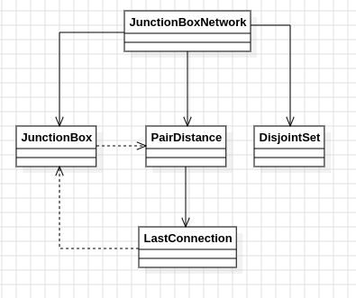

# Día 8b - Playground
Ya no basta con un número fijo de conexiones: hay que seguir conectando las parejas de cajas más cercanas, en orden creciente de distancia, hasta que **todas** las cajas terminen en un único circuito. Se pide el producto de las coordenadas X de las dos cajas que forman esa última conexión, la que termina de unificar toda la red.

## Modelado conceptual en UML
<div align="center">
  
</div>

## Qué cambia respecto a la parte A

**El criterio de parada deja de ser un número fijo y pasa a ser una propiedad del grafo**
En la parte A, `connectClosest(sortedPairs, connections)` simplemente procesaba las primeras `connections` parejas y se detenía — un límite externo, ajeno a la estructura de los datos. Aquí el criterio de parada es distinto: se sigue procesando pares en orden creciente de distancia hasta que el número de circuitos activos llega a `1`. Esto es exactamente el criterio de parada del **algoritmo de Kruskal** para construir un árbol de expansión mínimo: procesar aristas ordenadas por peso y detenerse tras exactamente `n - 1` uniones exitosas. No hace falta construir el árbol completo ni guardar la lista de aristas usadas — solo se necesita la última unión que provoca la unificación total, así que basta con contar cuántos circuitos quedan:
```java
public LastConnection lastConnectionToFullyConnect() {
    List<PairDistance> sortedPairs = closestPairsFirst();
    DisjointSet state = DisjointSet.singleTons(boxes.size());
    int remainingCircuits = boxes.size();

    for (PairDistance pair : sortedPairs) {
        DisjointSet next = state.union(pair.first(), pair.second());
        boolean merged = next != state;
        state = next;

        if (merged) {
            remainingCircuits--;
            if (remainingCircuits == 1)
                return new LastConnection(boxes.get(pair.first()), boxes.get(pair.second()));
        }
    }
    throw new IllegalStateException("The network never became fully connected");
}
```

**Aprovechar la semántica ya existente en vez de añadir estado nuevo**
`DisjointSet.union(a, b)` ya devolvía `this` (la misma instancia) cuando `a` y `b` estaban en el mismo circuito, como optimización natural de la estructura persistente de la parte A (`if (rootA == rootB) return this;`). Esa propiedad se reutiliza aquí como señal: comparando el resultado de `union` con el estado anterior por identidad (`next != state`) se sabe si la conexión fue realmente nueva. La alternativa sin esto sería volver a llamar a `find(a)` y `find(b)` antes y después de cada `union` para comparar si las raíces cambiaron — el doble de llamadas a `find` para obtener la misma información que `union` ya calculó internamente y descartó. Es una forma de resolver el problema apoyándose en el comportamiento que la estructura ya ofrecía, en vez de sumar lógica redundante encima.

**Value object con nombre para el resultado**
```java
public record LastConnection(JunctionBox first, JunctionBox second) {
    public long xProduct() {
        return first.x() * second.x();
    }
}
```
En vez de devolver un array de dos posiciones o un `Map.Entry<JunctionBox, JunctionBox>` sin significado explícito, el resultado se modela como un tipo con nombre propio. La diferencia práctica: quien llama a `lastConnectionToFullyConnect().xProduct()` no necesita saber *cómo* se calcula el producto de coordenadas X — ese conocimiento vive encapsulado junto a los datos que lo originan, no esparcido como una operación suelta (`result[0].x() * result[1].x()`) en el código cliente.

**Lo que NO cambia:** `JunctionBox`, `PairDistance` y `DisjointSet` no cambian ni una línea respecto a la parte A; toda la lógica nueva vive en [`JunctionBoxNetwork`](../src/main/java/software/aoc/day08/b/JunctionBoxNetwork.java) (parte B) y en el nuevo [`LastConnection`](../src/main/java/software/aoc/day08/b/LastConnection.java).

## Clean Code
- **Fail-fast**: si la red nunca llegase a conectarse del todo (por ejemplo, datos corruptos), se lanza `IllegalStateException` con un mensaje claro en vez de devolver `null` silenciosamente o dejar que el bucle termine sin resultado — un `null` ahí solo trasladaría el problema a quien reciba el resultado, sin contexto de qué salió mal.
- **Nombres que revelan intención**: `lastConnectionToFullyConnect`, `remainingCircuits`, `merged` — el código cuenta la misma historia que el propio enunciado del problema, sin necesitar comentarios adicionales.
- **Comparación por identidad como técnica deliberada**: usar `next != state` en vez de reimplementar la comprobación con `find` demuestra que aprovechar las garantías que ya ofrece una estructura inmutable (aquí, que `union` devuelve la misma referencia cuando no hay cambio real) simplifica el código sin sacrificar claridad — y solo es seguro precisamente *porque* `DisjointSet` es inmutable: si `union` mutara el estado en su sitio, comparar por identidad no diría nada útil.

## Tests
[`JunctionBoxNetworkTest`](../src/test/java/software/aoc/day08/b/JunctionBoxNetworkTest.java) comprueba, con el ejemplo del enunciado, que la última conexión necesaria para unificar toda la red es entre las cajas `216,146,977` y `117,168,530`, y que el producto de sus coordenadas X da `25272`, y un segundo test comprueba el resultado con el input real del puzzle (`answer`).