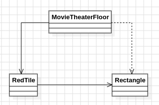

# Día 9a - Movie Theater
Se da una lista de baldosas rojas en una cuadrícula, como pares de coordenadas `x,y`. Hay que elegir dos baldosas rojas cualesquiera como esquinas opuestas de un rectángulo y encontrar el **área máxima** posible entre todos los pares. El área se cuenta de forma inclusiva (ambos bordes cuentan como parte del rectángulo).

## Modelo conceptual en UML

  

## Patrones de diseño
### Generar candidatos y seleccionar el mejor
Cualquier par de baldosas rojas es un candidato de rectángulo completamente independiente de los demás; el resultado es simplemente "el máximo entre todos los candidatos posibles". Forzar aquí una estructura con estado sería complejidad innecesaria — lo que el dominio pide de forma natural es **generar todas las combinaciones y quedarse con la de mayor área**, expresado directamente como `stream().mapToLong(Rectangle::area).max()`.

### Factory Method para encapsular la fórmula del dominio
`Rectangle.between(first, second)` es el único punto donde se construye un rectángulo a partir de dos esquinas, y `Rectangle.area()` es el único punto donde vive la fórmula `(|dx|+1) * (|dy|+1)`. Al mantener la fórmula encerrada en un solo sitio, si el criterio de conteo cambiara (por ejemplo, si dejara de ser inclusivo), solo habría que tocar una línea, sin buscar por todo el código dónde más se calculan áreas.

## Clean Code
- **Inmutabilidad de punta a punta**: [`RedTile`](../src/main/java/software/aoc/day09/a/RedTile.java), [`Rectangle`](../src/main/java/software/aoc/day09/a/Rectangle.java) y [`MovieTheaterFloor`](../src/main/java/software/aoc/day09/a/MovieTheaterFloor.java) son records inmutables; `MovieTheaterFloor` copia su lista de baldosas en el constructor compacto (`List.copyOf`).
- **SRP**: `RedTile` solo modela una posición en la cuadrícula; `Rectangle` solo sabe calcular su propia área a partir de dos esquinas; `MovieTheaterFloor` solo orquesta la generación de candidatos y la selección del máximo.
- **Fail-fast**: `largestRectangleArea()` lanza una excepción con mensaje descriptivo si no hay suficientes baldosas rojas para formar ningún rectángulo, en vez de devolver `0` silenciosamente y esconder un dato de entrada inválido.
- **Nombres que revelan intención**: `allPossibleRectangles`, `largestRectangleArea`, `between` — el código se lee casi como el propio enunciado del problema, sin necesitar comentarios.
- **Evitar bucles anidados dispersos por el código**: la generación de pares vive en un único método privado (`allPossibleRectangles`), separado de la lógica de selección del máximo, para que cada uno se pueda leer y testear por separado.

## Test
[`MovieTheaterFloorTest`](../src/test/java/software/aoc/day09/a/MovieTheaterFloorTest.java) comprueba que, con el ejemplo del enunciado, el área máxima encontrada entre todos los pares de baldosas rojas es `50`, y un segundo test valida el resultado con el input real del puzzle.