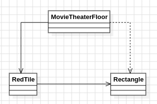

# Día 9a - Movie Theater
Se da una lista de baldosas rojas en una cuadrícula, como pares de coordenadas `x,y`. Hay que elegir dos baldosas rojas cualesquiera como esquinas opuestas de un rectángulo y encontrar el **área máxima** posible entre todos los pares. El área se cuenta de forma inclusiva (ambos bordes cuentan como parte del rectángulo).

## Modelado conceptual en UML
<div align="center">
  
</div>

## Patrones de diseño
### Generar candidatos y seleccionar el mejor
```java
public long largestRectangleArea() {
    return allPossibleRectangles().stream()
            .mapToLong(Rectangle::area)
            .max()
            .orElseThrow(() -> new IllegalStateException("Not enough red tiles to form a rectangle"));
}
```
Cualquier par de baldosas rojas es un candidato de rectángulo completamente independiente de los demás — evaluar uno no cambia lo que hay que hacer con el resto. Eso descarta de entrada cualquier estructura con estado mutable acumulándose entre iteraciones (un `for` con una variable `mejorHastaAhora` reasignada, por ejemplo): no hace falta, porque no hay ninguna dependencia entre candidatos. Lo que el dominio pide de forma natural es "generar todas las combinaciones y quedarse con la de mayor área", y eso es exactamente lo que dice `stream().mapToLong(Rectangle::area).max()` — sin ningún estado intermedio que gestionar a mano.

### Factory Method para encapsular la fórmula del dominio
```java
public record Rectangle(RedTile first, RedTile second) {
    public static Rectangle between(RedTile first, RedTile second) {
        return new Rectangle(first, second);
    }

    public long area() {
        long width = Math.abs(first.x() - second.x()) + 1;
        long height = Math.abs(first.y() - second.y()) + 1;
        return width * height;
    }
}
```
`Rectangle.between(first, second)` es el único punto donde se construye un rectángulo a partir de dos esquinas, y `area()` es el único punto donde vive la fórmula `(|dx|+1) * (|dy|+1)`. El `+1` es la parte que un lector podría pasar por alto o recalcular mal si estuviera repetida en varios sitios (es fácil olvidar que el conteo es inclusivo y devolver el área "de libro de texto" sin el +1). Al mantenerla encerrada en un solo método, si el criterio de conteo cambiara (por ejemplo, si dejara de ser inclusivo), solo habría que tocar esa línea una vez, en vez de buscar por todo el código dónde más se calculan áreas de rectángulos.

## Clean Code
- **Inmutabilidad de punta a punta**: [`RedTile`](../src/main/java/software/aoc/day09/RedTile.java), [`Rectangle`](../src/main/java/software/aoc/day09/a/Rectangle.java) y [`MovieTheaterFloor`](../src/main/java/software/aoc/day09/a/MovieTheaterFloor.java) son records inmutables; `MovieTheaterFloor` copia su lista de baldosas en el constructor compacto (`List.copyOf`), así que nadie por fuera puede añadir o quitar baldosas después de construirlo y alterar silenciosamente qué candidatos se generan.

- **SRP**: `RedTile` solo modela una posición en la cuadrícula; `Rectangle` solo sabe calcular su propia área a partir de dos esquinas; `MovieTheaterFloor` solo orquesta la generación de candidatos y la selección del máximo. Ninguna de las tres necesita saber cómo funcionan las otras dos por dentro.

- **Fail-fast con contexto**:
  ```java
  .orElseThrow(() -> new IllegalStateException("Not enough red tiles to form a rectangle"));
  ```
  La alternativa —devolver `0` cuando no hay suficientes baldosas para formar ningún rectángulo— parecería inofensiva, pero `0` es también un área válida en teoría, así que confundiría "no hay datos suficientes" con "el área máxima real es cero". Lanzar la excepción, con un mensaje que explica exactamente qué faltaba, evita esa ambigüedad de raíz.

- **Nombres que revelan intención**: `allPossibleRectangles`, `largestRectangleArea`, `between` — el código se lee casi como el propio enunciado del problema, sin necesitar comentarios.

- **Evitar bucles anidados dispersos por el código**:
  ```java
  private List<Rectangle> allPossibleRectangles() {
      List<Rectangle> rectangles = new ArrayList<>();
      for (int i = 0; i < tiles.size(); i++) {
          for (int j = i + 1; j < tiles.size(); j++) {
              rectangles.add(Rectangle.between(tiles.get(i), tiles.get(j)));
          }
      }
      return rectangles;
  }
  ```
  Este doble bucle es la única parte del código con complejidad ciclomática real (dos niveles de anidamiento), así que se aísla en su propio método privado con nombre, separado de la lógica de selección del máximo. Así, `largestRectangleArea()` se lee de corrido sin tener que "saltar mentalmente" sobre un bucle anidado en medio de una expresión de stream, y `allPossibleRectangles()` se puede testear o razonar sobre él de forma aislada si hiciera falta.

## Tests
[`MovieTheaterFloorTest`](../src/test/java/software/aoc/day09/a/MovieTheaterFloorTest.java) comprueba que, con el ejemplo del enunciado, el área máxima encontrada entre todos los pares de baldosas rojas es `50` (`finds_the_largest_rectangle_area`), y un segundo test valida el resultado con el input real del puzzle (`answer`).