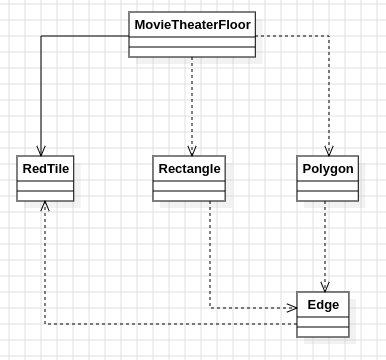

# Día 9b - Movie Theater 
Las baldosas rojas, tomadas en el orden de la lista, forman un polígono rectilíneo: cada par de rojas consecutivas está unido por un tramo de baldosas verdes, y la lista se cierra (la última se conecta con la primera). Ahora el rectángulo elegido debe seguir teniendo dos rojas en esquinas opuestas, pero **todo su interior** tiene que caer dentro de la región roja/verde delimitada por ese polígono. En el ejemplo, el área máxima posible baja de `50` (Parte A) a `24`.

## Modelo conceptual en UML

  

## Patrones de diseño
### El patrón central: Specification
La Parte A generaba todos los pares de baldosas y se quedaba directamente con el de mayor área. Aquí se mantiene esa misma fase de generación, pero se intercala una fase de **filtrado por una regla de negocio**: `stream().filter(polygon::contains).mapToLong(Rectangle::area).max()`. Esa llamada a `polygon::contains` es una aplicación del patrón **Specification**: la pregunta "¿es este rectángulo válido?" se encapsula como un predicado con nombre en su propia clase ([`Polygon`](../src/main/java/software/aoc/day09/b/Polygon.java)), en vez de dispersarse como condicionales sueltos dentro de [`MovieTheaterFloor`](../src/main/java/software/aoc/day09/b/MovieTheaterFloor.java). Gracias a esto, `MovieTheaterFloor` sigue sin saber nada de geometría: solo genera candidatos y delega la validación a quien sabe resolverla.

### Nueva responsabilidad geométrica, nueva clase
El polígono introduce un problema que no existía en la Parte A: decidir si un rectángulo cabe completamente dentro de una región delimitada por un contorno. En vez de mezclar esa lógica dentro de `MovieTheaterFloor` o de [`Rectangle`](../src/main/java/software/aoc/day09/b/Rectangle.java), se creó `Polygon`, que resuelve la pregunta en dos pasos: comprobar que el centro del rectángulo está dentro del polígono mediante *ray casting* (contar cruces de un rayo horizontal con las aristas verticales; un número impar de cruces indica "dentro"), y comprobar que ninguna arista del polígono atraviesa el interior estricto del rectángulo (tocar el borde está permitido, cruzarlo por dentro no). Con un polígono simple, ambas condiciones juntas garantizan que todo el rectángulo, no solo su centro, queda contenido.

## Clean Code
- **SRP**: `Polygon` es la única clase que conoce geometría (aristas, ray casting, solapamientos); `MovieTheaterFloor` sigue limitándose a "generar candidatos + seleccionar el máximo", sin mezclar ambas responsabilidades en una sola clase.
- **Reutilización del dominio compartido**: [`RedTile`](../src/main/java/software/aoc/day09/RedTile.java) no cambia respecto a la Parte A. `Rectangle` se extiende con accesores (`minX`, `maxX`, `minY`, `maxY`) que la nueva geometría necesita, sin tocar su Factory Method ni su cálculo de área existente.
- **Value object con comportamiento propio**: [`Edge`](../src/main/java/software/aoc/day09/b/Edge.java) no es un simple par de puntos — sabe responder `isVertical()`, evitando repetir la comparación `start.x() == end.x()` en cada sitio donde hiciera falta saber la orientación de una arista.
- **Nombres que revelan intención**: `centerIsInside`, `noEdgeCrossesInterior`, `straddlesY`, `overlaps` — cada método privado nombra un paso concreto del razonamiento geométrico, haciendo innecesarios los comentarios explicativos.
- **Inmutabilidad de punta a punta**: `Polygon`, `Edge` y `MovieTheaterFloor` son records inmutables; `Polygon` copia su lista de vértices en el constructor compacto (`List.copyOf`).
- **Fail-fast**: Si ningún candidato resulta válido dentro del polígono, se lanza una excepción con mensaje descriptivo en vez de devolver `0` silenciosamente.
- **Composición de streams en vez de bucles anidados con banderas**: Tanto la generación de candidatos como el filtrado y la selección del máximo se expresan como una cadena de streams (`filter` → `mapToLong` → `max`), sin variables de control ni booleanos acumuladores intermedios.

## Test
[`MovieTheaterFloorTest`](../src/test/java/software/aoc/day09/b/MovieTheaterFloorTest.java) comprueba, con el ejemplo del enunciado, que el área máxima de un rectángulo válido (con ambas esquinas rojas y todo su interior dentro del polígono rojo/verde) es `24`, y un segundo test valida el resultado con el input real del puzzle.