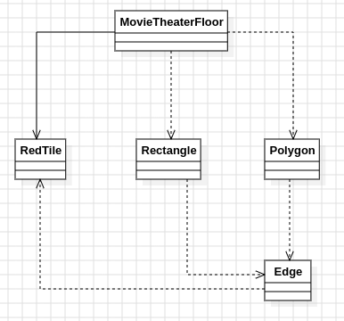

# Día 9b - Movie Theater
Las baldosas rojas, tomadas en el orden de la lista, forman un polígono rectilíneo: cada par de rojas consecutivas está unido por un tramo de baldosas verdes, y la lista se cierra (la última se conecta con la primera). Ahora el rectángulo elegido debe seguir teniendo dos rojas en esquinas opuestas, pero **todo su interior** tiene que caer dentro de la región roja/verde delimitada por ese polígono. En el ejemplo, el área máxima posible baja de `50` (parte A) a `24`.

## Modelado conceptual en UML
<div align="center">
  
</div>

## Qué cambia respecto a la parte A

**Se intercala una fase de filtrado, sin tocar la fase de generación**
La parte A generaba todos los pares de baldosas y se quedaba directamente con el de mayor área. Aquí se mantiene esa misma fase de generación tal cual, pero se intercala una fase de **filtrado por una regla de negocio** entre medias:
```java
public long largestRedGreenRectangleArea() {
    Polygon polygon = Polygon.from(orderedTiles);
    return allCandidateRectangles().stream()
            .filter(polygon::contains)
            .mapToLong(Rectangle::area)
            .max()
            .orElseThrow(() -> new IllegalStateException("No valid rectangle found"));
}
```
frente a la versión de la parte A (`.stream().mapToLong(Rectangle::area).max()`), la única diferencia real en esta línea es el `.filter(polygon::contains)` insertado en medio. Esa llamada a `polygon::contains` es la aplicación del patrón **Specification**: la pregunta "¿es este rectángulo válido?" se encapsula como un predicado con nombre en su propia clase ([`Polygon`](../src/main/java/software/aoc/day09/b/Polygon.java)), en vez de dispersarse como condicionales sueltos dentro de `MovieTheaterFloor`. Gracias a esto, `MovieTheaterFloor` sigue sin saber nada de geometría — solo genera candidatos y delega la validación a quien sabe resolverla.

**La nueva pregunta geométrica exige una clase nueva, no un método más en las que ya existían**
El polígono introduce un problema que no existía en la parte A: decidir si un rectángulo cabe completamente dentro de una región delimitada por un contorno. Meter esa lógica dentro de `MovieTheaterFloor` mezclaría "orquestar candidatos" con "entender geometría de polígonos" en una sola clase; meterla dentro de `Rectangle` le haría depender de un `Polygon` que no debería conocer (un rectángulo es un rectángulo, con o sin polígono alrededor). Por eso se creó `Polygon`, que resuelve la pregunta en dos pasos:
```java
public boolean contains(Rectangle rectangle) {
    return centerIsInside(rectangle) && noEdgeCrossesInterior(rectangle);
}
```
1. **`centerIsInside`** — *ray casting*: cuenta cuántas aristas verticales del polígono cruza un rayo horizontal trazado desde el centro del rectángulo hacia la derecha. Un número impar de cruces significa "dentro".
2. **`noEdgeCrossesInterior`** — comprueba que ninguna arista del polígono atraviesa el interior *estricto* del rectángulo (tocar el borde está permitido; cruzarlo por dentro no).

Con un polígono simple (sin auto-intersecciones), ambas condiciones juntas garantizan que todo el rectángulo, no solo su centro, queda contenido — comprobar solo el centro (paso 1) no bastaría por sí solo: un rectángulo grande podría tener el centro dentro del polígono mientras una de sus esquinas sobresale por fuera, y eso es precisamente lo que el paso 2 descarta.

**`Rectangle` se reescribe con accesores, aunque el área siga siendo la misma**
```java
// parte A
public long area() {
    long width = Math.abs(first.x() - second.x()) + 1;
    long height = Math.abs(first.y() - second.y()) + 1;
    return width * height;
}

// parte B
public long area() {
    return (maxX() - minX() + 1) * (maxY() - minY() + 1);
}
```
El resultado de `area()` es el mismo en ambas versiones, pero la implementación cambió: la parte B añade `minX()`, `maxX()`, `minY()`, `maxY()` porque `Polygon` los necesita para su propia geometría (comparar bordes de aristas contra los límites del rectángulo), y una vez que existen, expresar `area()` en términos de esos mismos accesores evita mantener dos formas distintas de calcular "el ancho" o "el alto" del mismo rectángulo dentro de la misma clase.

## Clean Code
- **SRP**: `Polygon` es la única clase que conoce geometría (aristas, ray casting, solapamientos); `MovieTheaterFloor` sigue limitándose a "generar candidatos + seleccionar el máximo", sin mezclar ambas responsabilidades en una sola clase.

- **Value object con comportamiento propio**:
  ```java
  public record Edge(RedTile start, RedTile end) {
      public boolean isVertical() {
          return start.x() == end.x();
      }
  }
  ```
  [`Edge`](../src/main/java/software/aoc/day09/b/Edge.java) no es un simple par de puntos — sabe responder `isVertical()`. Sin este método, la comparación `start.x() == end.x()` tendría que repetirse en cada uno de los tres sitios de `Polygon` que necesitan distinguir aristas verticales de horizontales (`centerIsInside`, `crossesInterior`), arriesgando que una futura corrección se aplicara en un sitio y se olvidara en otro.

- **Nombres que revelan intención**: `centerIsInside`, `noEdgeCrossesInterior`, `straddlesY`, `overlaps` — cada método privado nombra un paso concreto del razonamiento geométrico. Un lector puede entender la estrategia completa (centro dentro + ninguna arista cruza) solo con los nombres de los métodos, sin necesitar descifrar las comparaciones de coordenadas para saber qué representan.

- **Inmutabilidad de punta a punta**: `Polygon`, `Edge` y `MovieTheaterFloor` son records inmutables; `Polygon` copia su lista de vértices en el constructor compacto (`List.copyOf`).

- **Fail-fast**: si ningún candidato resulta válido dentro del polígono, se lanza una excepción con mensaje descriptivo en vez de devolver `0` silenciosamente — la misma razón que en la parte A: `0` sería indistinguible de "el área máxima real es cero".

- **Composición de streams en vez de bucles anidados con banderas**: tanto la generación de candidatos como el filtrado y la selección del máximo se expresan como una cadena de streams (`filter` → `mapToLong` → `max`), sin variables de control ni booleanos acumuladores intermedios que haya que rastrear mentalmente.

## Tests
[`MovieTheaterFloorTest`](../src/test/java/software/aoc/day09/b/MovieTheaterFloorTest.java) comprueba, con el ejemplo del enunciado, que el área máxima de un rectángulo válido (con ambas esquinas rojas y todo su interior dentro del polígono rojo/verde) es `24` (`finds_the_largest_rectangle_area`), y un segundo test valida el resultado con el input real del puzzle (`answer`).