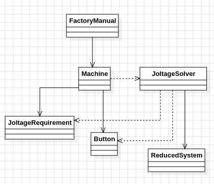

# Día 10a - Factory
Cada máquina tiene un panel de luces, todas apagadas al inicio, y varios botones; cada botón alterna (toggle) un subconjunto fijo de luces. Hay que encontrar el **mínimo número total de pulsaciones** de botones necesario para que el panel llegue exactamente al diagrama objetivo. El joltage (`{...}`) que aparece en cada línea es irrelevante para esta parte y se ignora explícitamente, tal como indica el enunciado.

## Modelo conceptual en UML

  

## Patrones de diseño
### El patrón central: el problema es un grafo, y BFS es la respuesta natural
Cada configuración posible de luces es un nodo, y cada botón es una arista que conecta un estado con otro (togglear luces = moverse de nodo). "Mínimo número de pulsaciones para alcanzar el objetivo" es, literalmente, "camino más corto en un grafo no ponderado" — el problema es BFS de forma directa, no una analogía forzada. Presionar dos veces el mismo botón siempre es subóptimo porque se anula a sí mismo, así que un BFS por niveles sobre el espacio de estados ya captura la solución óptima sin necesidad de lógica adicional para evitar repeticiones.

Ese algoritmo se aísla en su propia clase, [`ButtonPressSearch`](../src/main/java/software/aoc/day10/a/ButtonPressSearch.java), que no forma parte de la API pública del dominio: [`Machine`](../src/main/java/software/aoc/day10/a/Machine.java) representa "qué hay que resolver" (el objetivo y los botones disponibles) y delega en `ButtonPressSearch` el "cómo resolverlo". Separar el modelo del algoritmo de búsqueda permite razonar sobre cada uno por separado y sustituir el algoritmo en el futuro sin tocar el modelo del dominio.

### Botones como Command
Cada [`Button`](../src/main/java/software/aoc/day10/a/Button.java) encapsula una "petición de toggle" como objeto de primera clase: guarda su propio bitmask y colabora con `LightState.toggle` para producir un nuevo estado, sin que la lógica de búsqueda necesite conocer índices sueltos ni el formato original del texto. `ButtonPressSearch` solo ve botones que se pueden aplicar, no detalles de cómo se parsearon.

### Representación como bitmask
El estado de las luces se modela como un único `int mask` en vez de un `boolean[]`. Esto convierte "togglear ciertas luces" en una operación XOR directa (`mask ^ button.mask()`), evita comparaciones e implementaciones de `equals`/`hashCode` costosas sobre arrays, y expresa la semántica del enunciado ("alternar" es exactamente lo que hace XOR) de forma literal en el código.

## Clean Code
- **SRP**: [`LightState`](../src/main/java/software/aoc/day10/a/LightState.java) solo modela un estado de luces; `Button` solo modela y aplica un toggle; `Machine` solo agrega objetivo y botones, y sabe parsearse desde texto; `ButtonPressSearch` solo recorre el grafo de estados; [`FactoryManual`](../src/main/java/software/aoc/day10/a/FactoryManual.java) solo agrega máquinas y suma resultados.
- **Inmutabilidad de punta a punta**: `LightState`, `Button`, `Machine` y `FactoryManual` son records inmutables; `ButtonPressSearch.shortestPressCount()` no muta ningún estado existente, construye estructuras locales nuevas (`visited`, `nextLevel`) en cada iteración.
- **Fail-fast**: `parseTarget` lanza una excepción descriptiva si no encuentra el diagrama de luces en la línea; `shortestPressCount` lanza excepción si el BFS se agota sin alcanzar el objetivo, en vez de devolver `-1` o `0` de forma ambigua.
- **Nombres que revelan intención**: `shortestPressCount`, `parseTarget`, `parseButtons`, `currentLevel`/`nextLevel` — dejan clara la mecánica del BFS por niveles sin necesitar comentarios.
- **Ignorar deliberadamente los datos irrelevantes**: El parseo ni siquiera captura el joltage (`{...}`), evitando código muerto que procesara datos que el propio enunciado indica que no se usan en esta parte.
- **Clase de implementación no expuesta**: `ButtonPressSearch` es de paquete (sin `public`), dejando claro que es un detalle interno de cómo se resuelve `Machine.minPresses()`, no parte de la API del dominio.

## Test
[`FactoryManualTest`](../src/test/java/software/aoc/day10/a/FactoryManualTest.java) comprueba, con el ejemplo del enunciado, el mínimo de pulsaciones de cada máquina por separado (`2`, `3`, `2`), la suma total (`7`), y un tercer test valida el resultado con el input real del puzzle.