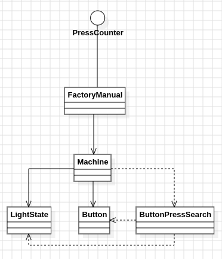

# Día 10a - Factory
Cada máquina tiene un panel de luces, todas apagadas al inicio, y varios botones; cada botón alterna (toggle) un subconjunto fijo de luces. Hay que encontrar el **mínimo número total de pulsaciones** de botones necesario para que el panel llegue exactamente al diagrama objetivo. El joltage que aparece en cada línea es irrelevante para esta parte y se ignora explícitamente, tal como indica el enunciado.

## Modelo conceptual en UML

  

## Diseño y patrones aplicados
### El problema ya es un grafo — `ButtonPressSearch`
Antes de pensar en qué algoritmo usar, conviene mirar qué es realmente "mínimo número de pulsaciones para llegar al objetivo": cada configuración posible de luces es un estado, y cada botón es una transición de un estado a otro. Eso es, literalmente, un grafo no ponderado, y "camino más corto" en un grafo no ponderado es BFS — no hace falta forzar la analogía ni evaluar alternativas más pesadas (Dijkstra, búsqueda con pesos) porque aquí no hay pesos que justificarlas: cada pulsación cuesta lo mismo.

Presionar dos veces el mismo botón siempre deshace su propio efecto (XOR es su propio inverso), así que un BFS por niveles sobre el espacio de estados ya captura la solución óptima sin necesidad de lógica adicional para evitar repeticiones — el propio `visited` del BFS se encarga.

Ese algoritmo se aísla en su propia clase, [`ButtonPressSearch`](../src/main/java/software/aoc/day10/a/ButtonPressSearch.java), que no forma parte de la API pública del dominio (ni siquiera es `public`): [`Machine`](../src/main/java/software/aoc/day10/a/Machine.java) representa *qué* hay que resolver (el objetivo y los botones disponibles) y delega en `ButtonPressSearch` el *cómo* resolverlo. Separar el modelo del algoritmo de búsqueda permite razonar sobre cada uno por separado, y sustituir el algoritmo en el futuro sin que ni `Machine` ni nada que dependa de ella se entere.

### Botones como Command — `Button`
Cada [`Button`](../src/main/java/software/aoc/day10/a/Button.java) encapsula una petición de toggle como objeto de primera clase: guarda su propio bitmask y colabora con `LightState.toggle` para producir un nuevo estado. La alternativa habría sido que `ButtonPressSearch` trabajara directamente con los índices de luces (`List<Integer>` por botón) y calculara el toggle a mano en cada paso — funcionaría, pero mezclaría "cómo se representa un botón" con "cómo se recorre el grafo de estados". Con `Button` como objeto, `ButtonPressSearch` solo ve botones que ya saben aplicarse a sí mismos; nunca conoce índices sueltos ni el formato original del texto.

### Representación como bitmask — `LightState`
El estado de las luces se modela como un único `int mask` en vez de un `boolean[]`. Esto convierte "togglear ciertas luces" en una operación XOR directa (`mask ^ button.mask()`), evita comparaciones e implementaciones de `equals`/`hashCode` costosas sobre arrays, y expresa la semántica del enunciado —"alternar"— de forma literal en el código en vez de simularla con bucles.

## Clean Code
- **Single Responsibility Principle**: `LightState` solo modela un estado de luces; `Button` solo modela y aplica un toggle; `Machine` solo agrega objetivo y botones, y sabe parsearse desde texto; `ButtonPressSearch` solo recorre el grafo de estados; [`FactoryManual`](../src/main/java/software/aoc/day10/a/FactoryManual.java) solo agrega máquinas y suma resultados.
- **Inmutabilidad de punta a punta**: `LightState`, `Button`, `Machine` y `FactoryManual` son records inmutables; `ButtonPressSearch.shortestPressCount()` no muta ningún estado existente, construye estructuras locales nuevas (`visited`, `nextLevel`) en cada nivel del BFS en vez de reutilizar y sobrescribir las del nivel anterior.
- **Fail-fast**: `parseTarget` lanza una excepción descriptiva si no encuentra el diagrama de luces en la línea; `shortestPressCount` lanza excepción si el BFS agota todo el espacio de estados alcanzable sin llegar al objetivo, en vez de devolver `-1` o `0` de forma ambigua.
- **Nombres que revelan intención**: `shortestPressCount`, `parseTarget`, `parseButtons`, `currentLevel`/`nextLevel` dejan clara la mecánica del BFS por niveles sin necesitar comentarios.
- **Ignorar deliberadamente los datos irrelevantes**: el parseo ni siquiera captura el joltage (`{...}`) de cada línea — evita código muerto que procesara datos que el propio enunciado indica que no se usan en esta parte.
- **Clase de implementación no expuesta**: `ButtonPressSearch` es de paquete (sin `public`), dejando claro que es un detalle interno de cómo se resuelve `Machine.minPresses()`, no parte de la API del dominio.

## Coste del algoritmo
BFS es la elección natural, pero el tamaño del espacio de estados que puede llegar a visitar depende del número de botones: en el peor caso, el conjunto de máscaras alcanzables puede acercarse a 2^(número de botones). `ButtonPressSearch` no impone ningún límite ni hace ninguna suposición sobre cuántos botones puede tener una máquina — funciona igual de bien con pocos que con muchos, simplemente tarda más si hay muchos. Para los tamaños de este puzzle no es un problema, pero vale la pena tenerlo presente: es una limitación del enfoque (fuerza bruta guiada por BFS), no un bug.

## Tests
[`FactoryManualTest`](../src/test/java/software/aoc/day10/a/FactoryManualTest.java) comprueba, con el ejemplo del enunciado, el mínimo de pulsaciones de cada máquina por separado (`2`, `3`, `2`) y la suma total (`7`); un tercer test valida el resultado con el input real del puzzle. Ningún test cubre `ButtonPressSearch` de forma aislada — solo se ejercita indirectamente a través de `Machine.minPresses()`.