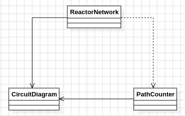

# Día 11a - Reactor
Se da una lista de dispositivos con sus conexiones de salida, formando un grafo dirigido donde los datos solo fluyen hacia adelante (nunca hacia atrás). Hay que contar **todos los caminos distintos** desde el dispositivo `you` hasta el dispositivo `out`. En el ejemplo del enunciado hay `5` caminos posibles entre ambos.

## Modelo conceptual en UML

  

## Patrones de diseño
### El patrón: recursión con memoización sobre un DAG
El problema es contar caminos en un grafo dirigido acíclico (DAG), no solo comprobar si existe alguno. Esto lo convierte en un caso típico de **subestructura solapada**: distintos caminos desde `you` pueden converger en el mismo dispositivo intermedio antes de llegar a `out` (en el ejemplo, tanto `bbb` como `ccc` llevan a `ddd`), y el número de caminos desde ese punto hacia `out` es idéntico sin importar por dónde se haya llegado. Recalcularlo cada vez llevaría a una recursión con coste exponencial en el peor caso.

[`PathCounter`](../src/main/java/software/aoc/day11/a/PathCounter.java) resuelve esto con recursión top-down y una caché (`memo`): la primera vez que se pregunta "¿cuántos caminos hay desde X hasta out?", el resultado se calcula sumando los caminos de sus sucesores y se guarda; cualquier pregunta posterior sobre el mismo dispositivo se responde en tiempo constante. Esto reduce el coste de exponencial a lineal en el número de dispositivos y conexiones del grafo.

### Separación entre el modelo del grafo y el algoritmo
[`CircuitDiagram`](../src/main/java/software/aoc/day11/CircuitDiagram.java) solo representa el grafo (qué dispositivo tiene qué salidas) y responde preguntas puntuales sobre él (`outputsOf`), sin saber nada de caminos ni de recursión. `PathCounter` es quien conoce el algoritmo de conteo con memoización, y [`ReactorNetwork`](../src/main/java/software/aoc/day11/a/ReactorNetwork.java) es la fachada pública que une ambos y expone directamente la pregunta del enunciado (`countPathsFromYouToOut`). Esta separación permite razonar y testear el modelo del grafo por un lado y el algoritmo de búsqueda por otro, sin mezclarlos en una sola clase.

## Clean Code
- **SRP**: `CircuitDiagram` solo modela el grafo; `PathCounter` solo sabe contar caminos con memoización; `ReactorNetwork` solo agrega ambos y traduce la pregunta del enunciado a una llamada concreta (`countPaths("you", "out")`).
- **Inmutabilidad del modelo**: `CircuitDiagram` copia su mapa de conexiones en el constructor compacto (`Map.copyOf`). La mutabilidad se confina deliberadamente a la caché interna de `PathCounter` (`memo`), que es un detalle de implementación del algoritmo de memoización, no parte del dominio inmutable.
- **Caso base explícito y claro**: `PathCounter.countPaths` comprueba primero `from.equals(to)` como caso base de la recursión, dejando la condición de parada en una única línea legible en vez de anidarla dentro de otras comprobaciones.
- **Nombres que revelan intención**: `countPathsFromYouToOut`, `outputsOf`, `memo` — cada nombre describe exactamente su papel en el algoritmo o en el dominio, sin necesitar comentarios adicionales.
- **Fachada simple sobre el dominio**: `ReactorNetwork` no expone detalles internos de cómo se cuenta (memoización, recursión); solo ofrece la pregunta de negocio ya resuelta, ocultando la complejidad del algoritmo detrás de un único método con nombre de dominio.

## Test
[`ReactorNetworkTest`](../src/test/java/software/aoc/day11/a/ReactorNetworkTest.java) comprueba, con el ejemplo del enunciado, que el número total de caminos de `you` a `out` es `5`, y un segundo test valida el resultado con el input real del puzzle.