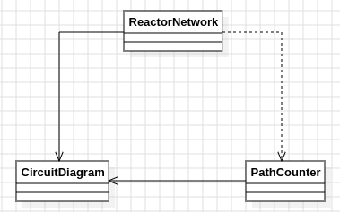

# Día 11a - Reactor
Se da una lista de dispositivos con sus conexiones de salida, formando un grafo dirigido donde los datos solo fluyen hacia adelante (nunca hacia atrás). Hay que contar **todos los caminos distintos** desde el dispositivo `you` hasta el dispositivo `out`. En el ejemplo del enunciado hay `5` caminos posibles entre ambos.

## Modelado conceptual en UML
<div align="center">
  
</div>

## Patrones de diseño
### El patrón: recursión con memoización sobre un DAG
El problema es contar caminos en un grafo dirigido acíclico (DAG), no solo comprobar si existe alguno. Esto lo convierte en un caso típico de **subestructura solapada**: distintos caminos desde `you` pueden converger en el mismo dispositivo intermedio antes de llegar a `out` (en el ejemplo, tanto `bbb` como `ccc` llevan a `ddd`), y el número de caminos desde ese punto hacia `out` es idéntico sin importar por dónde se haya llegado. Recalcularlo cada vez que se visita ese nodo llevaría a una recursión con coste exponencial en el peor caso, porque el mismo subárbol se explorarían tantas veces como caminos distintos lleguen a él.

```java
public long countPaths(String from, String to) {
    if (from.equals(to)) return 1;
    if (memo.containsKey(from)) return memo.get(from);

    long total = 0;
    for (String next : diagram.outputsOf(from)) total += countPaths(next, to);

    memo.put(from, total);
    return total;
}
```
[`PathCounter`](../src/main/java/software/aoc/day11/a/PathCounter.java) resuelve esto con recursión top-down y una caché (`memo`): la primera vez que se pregunta "¿cuántos caminos hay desde X hasta out?", el resultado se calcula sumando los caminos de sus sucesores y se guarda; cualquier pregunta posterior sobre el mismo dispositivo se responde en tiempo constante. Esto reduce el coste de exponencial a lineal en el número de dispositivos y conexiones del grafo.

Un detalle que merece explicarse: `memo` se indexa solo por `from`, sin incluir `to`. Esto sería incorrecto si un mismo `PathCounter` se usara para responder preguntas con destinos distintos (el caché de "caminos hasta out" se confundiría con el de "caminos hasta cualquier otro nodo"). Aquí es seguro porque cada instancia de `PathCounter` se crea y se usa una sola vez, para una única consulta con un `to` fijo (`"you"` a `"out"`) — dentro de esa única llamada, `to` nunca cambia, así que omitirlo de la clave no pierde información.

### Separación entre el modelo del grafo y el algoritmo
[`CircuitDiagram`](../src/main/java/software/aoc/day11/CircuitDiagram.java) solo representa el grafo (qué dispositivo tiene qué salidas) y responde preguntas puntuales sobre él (`outputsOf`), sin saber nada de caminos ni de recursión. `PathCounter` es quien conoce el algoritmo de conteo con memoización, y [`ReactorNetwork`](../src/main/java/software/aoc/day11/a/ReactorNetwork.java) es la fachada pública que une ambos:
```java
public long countPathFromYouToOut() {
    return new PathCounter(diagram).countPaths("you", "out");
}
```
Si `CircuitDiagram` conociera también el algoritmo de conteo, cualquier cambio futuro en cómo se cuenta (por ejemplo, la restricción de nodos obligatorios que trae la parte B) obligaría a tocar la misma clase que representa el grafo en sí. Con la separación actual, la parte B puede introducir un algoritmo de conteo distinto (`RequiredNodePathCounter`) reutilizando `CircuitDiagram` sin cambiar una línea de él.

## Clean Code
- **SRP**: `CircuitDiagram` solo modela el grafo; `PathCounter` solo sabe contar caminos con memoización; `ReactorNetwork` solo agrega ambos y traduce la pregunta del enunciado a una llamada concreta.

- **Inmutabilidad del modelo, mutabilidad confinada al algoritmo**: `CircuitDiagram` copia su mapa de conexiones en el constructor compacto (`Map.copyOf`). La mutabilidad se confina deliberadamente a la caché interna de `PathCounter` (`memo`), que es un detalle de implementación del algoritmo de memoización, no parte del dominio. La alternativa —un `PathCounter` que también fuera inmutable, devolviendo una copia de sí mismo con el caché actualizado en cada llamada— complicaría el código sin aportar nada: el caché no es un dato del dominio que alguien necesite leer o compartir, es un detalle interno de una única ejecución del algoritmo.

- **Caso base explícito y claro**:
  ```java
  if (from.equals(to)) return 1;
  ```
  Comprobar `from.equals(to)` como primera línea deja la condición de parada de la recursión en un solo sitio, legible de un vistazo, en vez de enterrarla dentro de una comprobación compuesta junto con el chequeo del caché.

- **Nombres que revelan intención**: `countPathFromYouToOut`, `outputsOf`, `memo` — cada nombre describe exactamente su papel en el algoritmo o en el dominio, sin necesitar comentarios adicionales.

- **Fachada simple sobre el dominio**: `ReactorNetwork` no expone detalles internos de cómo se cuenta (memoización, recursión, la propia existencia de `PathCounter`); solo ofrece la pregunta de negocio ya resuelta como un único método con nombre de dominio, ocultando la complejidad del algoritmo detrás de él.

## Tests
[`ReactorNetworkTest`](../src/test/java/software/aoc/day11/a/ReactorNetworkTest.java) comprueba, con el ejemplo del enunciado, que el número total de caminos de `you` a `out` es `5` (`count_all_paths_from_you_to_out`), y un segundo test valida el resultado con el input real del puzzle (`answer`).