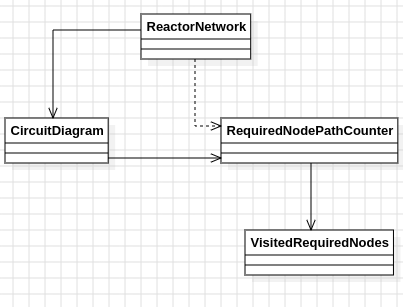

# Día 11b - Reactor
Ahora no basta con contar cualquier camino de `svr` a `out`: el camino debe pasar obligatoriamente por dos dispositivos concretos, `dac` y `fft`, en cualquier orden. En el ejemplo del enunciado, de los 8 caminos totales entre `svr` y `out`, solo `2` visitan ambos dispositivos obligatorios.

## Modelo conceptual en UML

  

## ¿Por qué la memoización por nodo ya no basta?
La condición extra rompe la propiedad que hacía funcionar la memoización de la parte anterior: el número de caminos válidos desde un nodo hasta `out` ya no depende solo de la posición actual en el grafo, sino también de si el camino recorrido hasta ahí ya pasó por `dac` y/o `fft`. Dos caminos distintos que lleguen al mismo nodo pueden tener conteos de caminos válidos completamente diferentes según qué obligatorios hayan visitado ya. Por eso la clave de memoización se amplía de "solo el nodo actual" a "el nodo actual **junto con** qué subconjunto de nodos obligatorios se ha visitado hasta el momento" — una técnica estándar cuando la respuesta depende del historial del camino y no únicamente de la posición. Como el conjunto de nodos obligatorios es pequeño (2 en el ejemplo, y previsiblemente pocos en el input real), el espacio de estados sigue siendo perfectamente manejable: nodos × combinaciones posibles de obligatorios visitados.

## Patrones de diseño
### Un value object nuevo para el estado del historial
[`VisitedRequiredNodes`](../src/main/java/software/aoc/day11/b/VisitedRequiredNodes.java) encapsula qué subconjunto de los nodos obligatorios se ha visto hasta el momento y sabe responder por sí mismo si ya se cumplió la condición completa (`hasVisitedAll`). En vez de que la clase de búsqueda manipule directamente un `Set<String>` suelto o un bitmask sin nombre, este concepto del dominio ("progreso de la restricción de nodos obligatorios") queda representado como un tipo propio, inmutable, con su propio comportamiento (`markVisited`).

### Generalización de la API pública
La Parte A exponía un método fijo pensado solo para el par de nodos concreto del enunciado. Aquí [`ReactorNetwork`](../src/main/java/software/aoc/day11/b/ReactorNetwork.java) se generaliza a `countPathsThroughRequiredDevices(from, to, requiredDevices)`, parametrizando origen, destino y el conjunto de dispositivos obligatorios — reflejando que el problema ya no es "cuenta los caminos entre estos dos nodos fijos" sino "cuenta los caminos entre dos nodos cualesquiera que además cumplan una restricción arbitraria sobre el camino".

## Clean Code
- **SRP**: `VisitedRequiredNodes` solo rastrea qué obligatorios se han visitado; [`RequiredNodePathCounter`](../src/main/java/software/aoc/day11/b/RequiredNodePathCounter.java) solo orquesta la recursión con memoización sobre el estado ampliado; `CircuitDiagram` (compartida, sin cambios) sigue sin saber nada de caminos ni de restricciones.
- **Inmutabilidad**: `VisitedRequiredNodes.markVisited` nunca muta el conjunto existente — construye y devuelve una instancia nueva ante cada nodo obligatorio recién visitado, consistente con el resto de value objects inmutables del proyecto.
- **Nombres que revelan intención**: `markVisited`, `hasVisitedAll`, `countPathsThroughRequiredDevices`, `encode` — cada nombre describe con precisión su papel dentro del algoritmo o del dominio, sin necesitar comentarios.
- **Clave de memoización explícita y legible**: La clave combina el nodo actual con la codificación del estado de visitados (`current + "|" + updated.encode()`), dejando claro en una sola línea qué información distingue a un estado de otro, en vez de depender de una estructura compuesta opaca.
- **Reutilización sin duplicar dominio**: El modelo del grafo (`CircuitDiagram`) se comparte tal cual desde el paquete raíz, sin tocar una línea, siguiendo el mismo criterio aplicado en días anteriores para elementos del dominio que no cambian entre partes de un mismo problema.

## Test
[`ReactorNetworkTest`](../src/test/java/software/aoc/day11/b/ReactorNetworkTest.java) comprueba, con el ejemplo del enunciado, que el número de caminos de `svr` a `out` que visitan tanto `dac` como `fft` es `2`, y un segundo test valida el resultado con el input real del puzzle.