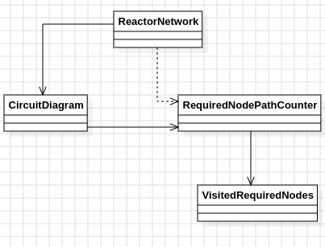

# Día 11b - Reactor
Ahora no basta con contar cualquier camino de `svr` a `out`: el camino debe pasar obligatoriamente por dos dispositivos concretos, `dac` y `fft`, en cualquier orden. En el ejemplo del enunciado, de los 8 caminos totales entre `svr` y `out`, solo `2` visitan ambos dispositivos obligatorios.

## Modelado conceptual en UML
<div align="center">
  
</div>

## Qué cambia respecto a la parte A

**Por qué la memoización por nodo deja de ser correcta**
En la parte A, `memo.put(from, total)` era seguro precisamente porque "cuántos caminos hay desde `X` hasta `out`" era una pregunta que dependía únicamente de `X` — daba igual por dónde se hubiera llegado hasta ahí. La condición extra de esta parte rompe justo esa propiedad: el número de caminos *válidos* desde un nodo hasta `out` ya no depende solo de la posición actual, sino también de si el camino recorrido hasta ahí ya pasó por `dac` y/o `fft`. Dos caminos distintos que lleguen al mismo nodo pueden tener conteos de caminos válidos completamente diferentes según qué obligatorios hayan visitado ya — memoizar solo por nodo mezclaría esos dos casos como si fueran el mismo, dando un resultado incorrecto.

**La clave de memoización se amplía, no se sustituye**
```java
private long countPaths(String current, String destination, VisitedRequiredNodes visited) {
    VisitedRequiredNodes updated = visited.markVisited(current);

    if (current.equals(destination)) return updated.hasVisitedAll() ? 1 : 0;
    String key = current + "|" + updated.encode();
    if (memo.containsKey(key)) return memo.get(key);

    long total = 0;
    for (String next : diagram.outputsOf(current)) total += countPaths(next, destination, updated);
    memo.put(key, total);
    return total;
}
```
La clave pasa de "solo el nodo actual" a "el nodo actual **junto con** qué subconjunto de nodos obligatorios se ha visitado hasta el momento" (`current + "|" + updated.encode()`) — una técnica estándar cuando la respuesta depende del historial del camino y no únicamente de la posición. `destination` sigue sin aparecer en la clave, por la misma razón que en la parte A: es fijo dentro de una misma instancia de `RequiredNodePathCounter`, así que no hace falta distinguir por él. Como el conjunto de nodos obligatorios suele ser pequeño (2 en el ejemplo), el espacio de estados sigue siendo perfectamente manejable: nodos × combinaciones posibles de obligatorios visitados, en vez de crecer sin control.

**Un value object nuevo para ese estado extra**
```java
public record VisitedRequiredNodes(Set<String> requiredNodes, Set<String> visited) {
    public VisitedRequiredNodes markVisited(String node) {
        if (!requiredNodes.contains(node) || visited.contains(node)) return this;
        Set<String> newVisited = new TreeSet<>(visited);
        newVisited.add(node);
        return new VisitedRequiredNodes(requiredNodes, newVisited);
    }

    public boolean hasVisitedAll() {
        return visited.containsAll(requiredNodes);
    }

    public String encode() {
        return String.join(",", new TreeSet<>(visited));
    }
}
```
La alternativa habría sido que `RequiredNodePathCounter` manipulara directamente un `Set<String>` suelto (o, peor, un bitmask sin nombre) para representar "qué obligatorios llevo vistos". En su lugar, ese concepto del dominio — "progreso de la restricción de nodos obligatorios" — se modela como un tipo propio, inmutable (`markVisited` siempre devuelve una instancia nueva, nunca muta `visited` en el sitio), con su propio comportamiento: sabe ignorarse a sí mismo cuando el nodo no es relevante (`if (!requiredNodes.contains(node) || visited.contains(node)) return this;`, evitando copias innecesarias), sabe decir si ya se cumplió la condición completa (`hasVisitedAll`), y sabe codificarse de forma determinista para servir como parte de una clave de caché (`encode`, usando `TreeSet` para que el orden de visita no cambie la codificación).

**La API pública se generaliza en vez de ampliarse con parámetros nuevos**
La parte A exponía `countPathFromYouToOut()`: un método fijo, pensado solo para el par de nodos concreto del enunciado. Aquí [`ReactorNetwork`](../src/main/java/software/aoc/day11/b/ReactorNetwork.java) pasa a:
```java
public long countPathsThroughRequiredDevices(String from, String to, Set<String> requiredDevices) {
    return new RequiredNodePathCounter(diagram, requiredDevices).countPaths(from, to);
}
```
en vez de, por ejemplo, mantener `countPathFromYouToOut()` y añadirle un parámetro más (`countPathFromYouToOut(Set<String> required)`). Generalizar los tres datos (origen, destino, y el conjunto de obligatorios) en vez de fijar dos de ellos refleja que el problema ya no es "cuenta los caminos entre estos dos nodos fijos" sino "cuenta los caminos entre dos nodos cualesquiera que además cumplan una restricción arbitraria sobre el camino" — que es la pregunta real que plantea el enunciado de esta parte.

**Lo que NO cambia:** [`CircuitDiagram`](../src/main/java/software/aoc/day11/CircuitDiagram.java) se reutiliza tal cual desde el paquete raíz, sin tocar una línea — nada en cómo se representa el grafo depende de si luego se cuenta con o sin restricción de nodos obligatorios.

## Clean Code
- **SRP**: `VisitedRequiredNodes` solo rastrea qué obligatorios se han visitado; [`RequiredNodePathCounter`](../src/main/java/software/aoc/day11/b/RequiredNodePathCounter.java) solo orquesta la recursión con memoización sobre el estado ampliado; `CircuitDiagram` sigue sin saber nada de caminos ni de restricciones.
- **Inmutabilidad**: `VisitedRequiredNodes.markVisited` nunca muta el conjunto existente — construye y devuelve una instancia nueva ante cada nodo obligatorio recién visitado, consistente con el resto de value objects inmutables del proyecto.
- **Nombres que revelan intención**: `markVisited`, `hasVisitedAll`, `countPathsThroughRequiredDevices`, `encode` — cada nombre describe con precisión su papel dentro del algoritmo o del dominio, sin necesitar comentarios.
- **Clave de memoización explícita y legible**: la clave combina el nodo actual con la codificación del estado de visitados en una sola línea (`current + "|" + updated.encode()`), dejando claro qué información distingue a un estado de otro, en vez de depender de una estructura compuesta opaca (un `record` usado como clave de `Map`, por ejemplo, habría funcionado igual mecánicamente, pero un `String` legible ayuda a depurar directamente si algo falla).

## Tests
[`ReactorNetworkTest`](../src/test/java/software/aoc/day11/b/ReactorNetworkTest.java) comprueba, con el ejemplo del enunciado, que el número de caminos de `svr` a `out` que visitan tanto `dac` como `fft` es `2` (`counts_paths_through_required_devices`), y un segundo test valida el resultado con el input real del puzzle (`answer`).