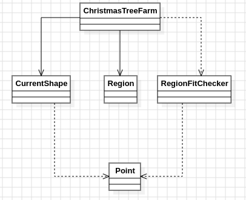

# Día 12 - Christmas Tree Farm
Se da un catálogo de formas de regalo (poliominós, definidos como diagramas de `#`/`.`) y una lista de regiones rectangulares, cada una con cuántos regalos de cada forma debe albergar. Las piezas se pueden rotar y reflejar libremente, deben encajar perfectamente en la cuadrícula, y no pueden solaparse — pero **no hace falta cubrir toda la región**: puede quedar espacio libre. Hay que contar cuántas regiones consiguen encajar todos sus regalos requeridos. En el ejemplo del enunciado, de 3 regiones, `2` consiguen encajar todo lo que necesitan.

## Modelado conceptual en UML
<div align="center">
  
</div>

## Patrones de diseño
### El patrón: backtracking guiado por la celda más restringida
Encajar piezas de formas irregulares en un área sin solaparse, con rotaciones y reflexiones, es el problema clásico de empaquetado de poliominós — el mismo tipo de problema que Knuth formalizó como ejemplo canónico de *exact cover* con su Algorithm X. La heurística central que se aplica aquí es la misma idea de fondo: en vez de preguntar "¿dónde puedo colocar esta pieza?" (que genera un árbol de búsqueda enorme y redundante, probando la misma pieza en decenas de posiciones sin criterio), se pregunta "¿qué puede llenar este hueco concreto?" — siempre se elige la primera celda vacía del tablero y se prueba a cubrirla con cada pieza y orientación disponible:
```java
private static boolean solve(boolean[][] occupied, int[] remaining, List<CurrentShape> catalog, Region region, int[] shapeAreas, int totalCells, int occupiedCount) {
    if (allZero(remaining)) return true;
    int remainingArea = remainingArea(remaining, shapeAreas);
    int freeCells = totalCells - occupiedCount;

    if (remainingArea > freeCells) return false;
    Optional<Point> targetCell = firstEmptyCell(occupied, region);

    if (targetCell.isEmpty()) return false;
    Point target = targetCell.get();

    if (tryPlacingAnyPiece(occupied, remaining, catalog, region, target, shapeAreas, totalCells, occupiedCount)) {
        return true;
    }
    return trySkippingCell(occupied, remaining, catalog, region, target, shapeAreas, totalCells, occupiedCount);
}
```
Fijar siempre la *misma* celda objetivo (la primera vacía) en vez de dejar que el algoritmo elija libremente dónde intentar en cada paso poda drásticamente el espacio de búsqueda: cualquier solución válida tiene que cubrir esa celda concreta de alguna manera (con una pieza, o marcándola vacía a propósito), así que no hace falta explorar colocaciones de piezas en celdas que ya estaban resueltas en pasos anteriores.

A diferencia de un *exact cover* puro, este problema permite dejar celdas sin cubrir, así que el backtracking necesita una rama adicional explícita: si ninguna pieza puede cubrir la celda objetivo (o simplemente se decide no intentarlo), el algoritmo también prueba a **marcarla como vacía a propósito**:
```java
private static boolean trySkippingCell(boolean[][] occupied, int[] remaining, List<CurrentShape> catalog, Region region, Point target, int[] shapeAreas, int totalCells, int occupiedCount) {
    occupied[target.x()][target.y()] = true;
    boolean success = solve(occupied, remaining, catalog, region, shapeAreas, totalCells, occupiedCount + 1);
    occupied[target.x()][target.y()] = false;
    return success;
}
```
y continuar la búsqueda en el resto del tablero, en vez de descartar la rama por completo. Sin esta rama, el algoritmo fallaría regiones que en realidad sí son válidas simplemente porque quedaba una celda suelta que ninguna pieza cubría exactamente ahí.

### Poda por presupuesto de área
```java
int remainingArea = remainingArea(remaining, shapeAreas);
int freeCells = totalCells - occupiedCount;
if (remainingArea > freeCells) return false;
```
Antes de seguir bajando en la recursión, `solve` comprueba si el área total de las piezas que aún faltan por colocar supera el número de celdas libres que quedan en el tablero. Es una condición *necesaria* (no suficiente) muy barata de calcular — sumar unos pocos enteros — frente a la alternativa de descubrir la inviabilidad "a lo bruto": seguir bajando en la recursión, probando piezas y deshaciendo colocaciones, hasta que el propio `firstEmptyCell`/`tryPlacingAnyPiece` fallen varios niveles más abajo. Esta poda es la que hace viable detectar con rapidez las regiones que, como una de las tres del ejemplo, definitivamente no pueden encajar todo lo requerido, sin agotar antes todas las combinaciones de colocación posibles.

## Clean Code
- **SRP**: [`Point`](../src/main/java/software/aoc/day12/a/Point.java) solo modela una coordenada; [`CurrentShape`](../src/main/java/software/aoc/day12/a/CurrentShape.java) sabe representarse y calcular sus orientaciones únicas, además de su propia área (`area()`); [`Region`](../src/main/java/software/aoc/day12/a/Region.java) solo modela dimensiones y requisitos; [`RegionFitChecker`](../src/main/java/software/aoc/day12/a/RegionFitChecker.java) es el único responsable del algoritmo de encaje; [`ChristmasTreeFarm`](../src/main/java/software/aoc/day12/a/ChristmasTreeFarm.java) solo agrega el catálogo y las regiones, y sabe parsearse desde texto.

- **Cálculo costoso hecho una sola vez**:
  ```java
  private static List<Set<Point>> uniqueOrientationsOf(Set<Point> baseCells) {
      Set<Set<Point>> unique = new HashSet<>();
      for (int flip = 0; flip < 2; flip++) {
          Set<Point> variant = flip == 0 ? baseCells : mirror(baseCells);
          for (int rotation = 0; rotation < 4; rotation++) {
              unique.add(variant);
              variant = rotateClockwise(variant);
          }
      }
      return List.copyOf(unique);
  }
  ```
  Las orientaciones de cada forma (2 reflexiones × 4 rotaciones = 8 combinaciones, normalizadas y deduplicadas con `Set<Set<Point>>` porque una pieza simétrica genera menos de 8 orientaciones distintas) se calculan una única vez durante el parseo, al construir el `CurrentShape`. La alternativa —recalcular rotaciones y reflexiones cada vez que el backtracking prueba a colocar una pieza— repetiría el mismo cálculo geométrico miles de veces durante una búsqueda profunda, por un resultado que nunca cambia entre intentos.

- **`Point` como record**: Al ser un record, `equals`/`hashCode` se generan automáticamente por valor. Sin esto, `HashSet<Set<Point>>` no podría reconocer que dos orientaciones calculadas por caminos distintos (por ejemplo, una rotación de 180° obtenida rotando dos veces, frente a la misma forma obtenida reflejando y rotando) son en realidad la misma orientación — las trataría como duplicados válidos en vez de colapsarlas en una sola.

- **Mutabilidad aislada y controlada**: El único estado mutable del algoritmo (`boolean[][] occupied`, `int[] remaining`) vive dentro de `RegionFitChecker`, con operaciones explícitas de "marcar y deshacer" (`setOccupied(..., true/false)`, `remaining[shapeIndex]--`/`++`) propias del patrón backtracking — necesarias aquí porque backtracking sin mutación explícita en el sitio (por ejemplo, copiando el tablero completo en cada intento) sería mucho más costoso en memoria y tiempo para un tablero que puede tener bastantes celdas. Esa mutabilidad no se filtra al resto del dominio: `Point`, `CurrentShape`, `Region` y `ChristmasTreeFarm` son todos records inmutables.

- **Nombres que revelan intención**: `firstEmptyCell`, `canPlace`, `tryOrientationAt`, `trySkippingCell`, `remainingArea`, `allZero` — cada método nombra con precisión el paso concreto del algoritmo que resuelve, sin necesitar comentarios.

- **Fail-fast en el parseo**: `Region.from` lanza una excepción con mensaje descriptivo si una línea no cumple el formato esperado de dimensiones y requisitos, en vez de dejar que un `Matcher` sin coincidencia falle más adelante con un error críptico al intentar leer un grupo inexistente.

## Tests
[`ChristmasTreeFarmTest`](../src/test/java/software/aoc/day12/a/ChristmasTreeFarmTest.java) comprueba, con el ejemplo del enunciado, que el número de regiones donde todos los regalos requeridos encajan es `2` (`counts_regions_where_all_presents_fit`), y un segundo test valida el resultado con el input real del puzzle (`answer`).